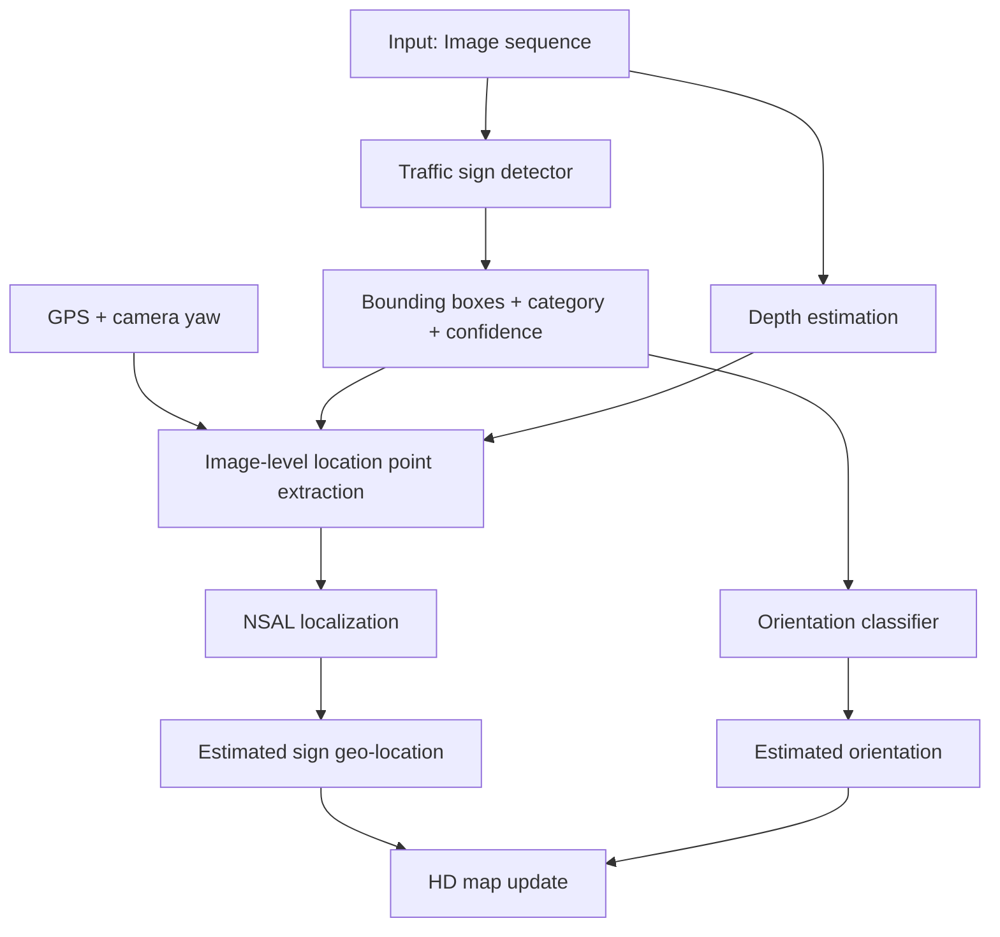

# Detailed Proposal Report  
# Sparse Recovery for Vision-GPS Traffic Sign Localization


**Môn học:** COMP5340 Compressive Sensing and Sparse Recovery  
**Paper nền:** Han et al. 2025, *Traffic Sign Localization and Orientation Classification for Automated Map Updating*  
**Project direction:** Sparse-aware traffic sign localization from noisy Vision-GPS observations  
**Contribution:** Stage **location point aggregation / localization recovery**  

---

# 0. Câu chuyện tổng quát trong 1 phút

Paper AutoTS giải quyết bài toán:

> Xe chạy trên đường, camera chụp nhiều ảnh. Từ chuỗi ảnh đó và GPS của xe, hệ thống cần tự động tìm biển báo giao thông, xác định vị trí thật của biển báo trên bản đồ, và xác định hướng của biển báo để biết biển báo đó thuộc đường nào.

Pipeline đầy đủ của paper có 3 phần lớn:

```text
Ảnh đường phố + GPS
        ↓
Detect traffic sign trong từng ảnh
        ↓
Tạo nhiều estimated location points cho cùng một sign
        ↓
Gom các points bị noisy/sparse thành một final geo-location
        ↓
Classify orientation của sign
        ↓
Update HD map
```

Project của nhóm **không cố làm lại toàn bộ hệ thống**. Nhóm tập trung vào phần khớp nhất với môn Compressed Sensing:

```text
Nhiều location points bị noisy/sparse/outlier
        ↓
Recover vị trí thật của traffic sign
```

Nói ngắn gọn:

> Paper gốc dùng **NSAL** để gom các location points bằng graph density và MinCut.  
> Nhóm mình sẽ diễn giải bài toán này thành **sparse outlier recovery** và thử các method lấy cảm hứng từ compressed sensing, đặc biệt là **L1 Sparse Outlier Recovery** và **Uncertainty-Aware Sparse Point Aggregation**.

---

# 1. Problem Definition

## 1.1 What: Bài toán nhóm mình thật sự giải quyết là gì?

Với mỗi traffic sign, hệ thống có nhiều estimated location points:

$$
P_s = \{p_1, p_2, \ldots, p_k\}
$$

Mỗi point:

$$
p_i =
\begin{bmatrix}
x_i \\
y_i
\end{bmatrix}
\in \mathbb{R}^2
$$

là vị trí ước lượng của cùng một traffic sign từ frame thứ $$i$$.

Nếu mọi thứ hoàn hảo, tất cả các point $$p_i$$ phải nằm gần vị trí thật của biển báo:

$$
l_s =
\begin{bmatrix}
x_s \\
y_s
\end{bmatrix}
$$

Nhưng thực tế, các point có thể lệch do:

- GPS của xe bị noise;
- depth estimation sai;
- detector box lệch;
- camera yaw không chính xác;
- sign ở xa nên bbox nhỏ;
- sign bị che hoặc blur;
- chỉ có vài frames nhìn thấy sign.

Vì vậy, bài toán là:

> Từ nhiều estimated location points bị noisy, sparse, có thể có outliers, làm sao recover vị trí thật của traffic sign?

Formal form:

$$
f(P_s) = \tilde{l}_s
$$

Trong đó:

- $$P_s$$: set các observed location points;
- $$f$$: aggregation/recovery method;
- $$\tilde{l}_s$$: estimated final sign location.

Mục tiêu:

$$
\tilde{l}_s \approx l_s^{GT}
$$

với $$l_s^{GT}$$ là ground-truth GPS location của traffic sign.

---

## 1.2 Why: Vì sao bài toán này quan trọng?

Trong HD map, vị trí biển báo cần đủ chính xác. Nếu estimated location sai vài mét:

- biển báo có thể bị gán nhầm vào road segment khác;
- bản đồ HD map bị update sai;
- downstream autonomous driving / routing system có thể hiểu sai luật giao thông.

Quan trọng hơn, đây là bài toán rất hợp với compressed sensing:

- số observations có thể ít;
- measurements bị noise;
- một số observations bị lỗi rất lớn;
- ta cần recover latent signal $$l_s$$ từ corrupted observations.

---

## 1.3 How: Cách nhìn sparse recovery

Ta model mỗi observation như sau:

$$
p_i = l_s + e_i + \epsilon_i
$$

Giải thích từng thành phần:

| Ký hiệu | Ý nghĩa | Dạng |
|---|---|---|
| $$p_i$$ | observed/estimated location point từ frame $$i$$ | vector 2D |
| $$l_s$$ | true sign location cần recover | vector 2D |
| $$e_i$$ | gross error / outlier của frame $$i$$ | vector 2D, thường bằng 0 |
| $$\epsilon_i$$ | small dense noise | vector 2D, nhỏ |

Assumption chính:

> Không phải frame nào cũng sai nặng. Chỉ một số ít frames có gross error lớn. Vì vậy $$e_i$$ là sparse outlier.

Nói bằng lời:

```text
Mỗi point = vị trí thật + lỗi lớn hiếm gặp + nhiễu nhỏ thường gặp
```

Đây là điểm nối giữa project và compressed sensing/sparse recovery.

---

# 2. Input/Output của từng stage trong pipeline

Phần này rất quan trọng để biết method của nhóm nằm ở đâu.

## 2.1 Full pipeline của paper gốc



---

## 2.2 Stage-by-stage explanation

## Stage 1: Image sequence

### Input

Chuỗi ảnh đường phố:

$$
I_s = \{I_1, I_2, \ldots, I_{N_s}\}
$$

### Output

Một sequence các frames có chứa hoặc có thể chứa traffic sign.

### Why needed?

Traffic sign có thể xuất hiện trong nhiều frame khi xe đi tới gần nó. Nhiều frames giúp tạo nhiều observations cho cùng một sign.

### Project có contribute không?

Không. Nhóm dùng lại dataset/pipeline có sẵn.

---

## Stage 2: Traffic sign detection

### Input

Một frame ảnh:

$$
I_i
$$

### Output

Detector trả về:

| Output | Ý nghĩa |
|---|---|
| $$b_i$$ | bounding box của sign trong frame $$i$$ |
| $$c_i$$ | detection confidence |
| category | loại sign, ví dụ Yield, Speed Limit |
| ROI feature | feature của vùng ảnh chứa sign |

### Paper gốc dùng gì?

Paper dùng Faster R-CNN đã fine-tune trên traffic sign data.

### Why needed?

Nếu không biết sign nằm ở đâu trong ảnh, ta không thể:

- lấy depth tại vị trí sign;
- tính center deviation của bbox;
- project sign từ ảnh ra tọa độ bản đồ.

### Project có contribute không?

Không. Detector không phải trọng tâm compressed sensing.

---

## Stage 3: Depth estimation

### Input

Frame ảnh $$I_i$$ và bounding box $$b_i$$.

### Output

Depth của sign:

$$
d_i
$$

### $$d_i$$ là gì?

$$d_i$$ là estimated distance từ camera đến sign.

### Why needed?

GPS của xe chỉ cho biết vị trí camera/vehicle, không cho biết sign cách xe bao xa. Để project sign ra world coordinate, cần biết sign nằm cách camera bao nhiêu mét.

### Project có contribute không?

Không. Nhóm dùng precomputed/generated depth hoặc location points.

---

## Stage 4: Image-level location point extraction

### Input

Stage này nhận:

| Ký hiệu | Ý nghĩa |
|---|---|
| $$b_i$$ | bounding box của sign |
| $$d_i$$ | depth từ camera đến sign |
| $$g_i$$ | GPS của camera/vehicle |
| $$\theta_i^c$$ | camera yaw trong world coordinate |
| FOV | horizontal field of view |

### Output

Một location point:

$$
p_i =
\begin{bmatrix}
x_i \\
y_i
\end{bmatrix}
$$

hoặc dạng latitude/longitude.

### Formula trong paper

Paper tính yaw angle của sign so với camera:

$$
\theta_i^t = \frac{FOV}{2} b_i^*
$$

Sau đó dùng hàm geometry:

$$
p_i = Geo(\theta_i^t, \theta_i^c, d_i, g_i)
$$

### Công thức này là gì?

Đây là công thức biến thông tin image-level thành một point trên bản đồ.

Nó dùng:

- vị trí camera $$g_i$$;
- hướng camera $$\theta_i^c$$;
- góc lệch của sign trong ảnh $$\theta_i^t$$;
- khoảng cách tới sign $$d_i$$.

### Tại sao output là $$p_i$$?

Vì mỗi frame chỉ tạo ra một ước lượng vị trí của sign. Nếu sign xuất hiện trong $$k$$ frames, ta có $$k$$ location points:

$$
P_s = \{p_1, p_2, \ldots, p_k\}
$$

### Sau stage này ta có gì?

Ta có một point cloud nhỏ cho mỗi traffic sign.

Ví dụ:

```text
sign_id = train/3
P_s = [
  p_1 = (x_1, y_1),
  p_2 = (x_2, y_2),
  ...
  p_14 = (x_14, y_14)
]
```

### Vấn đề phát sinh

Các point không trùng nhau hoàn hảo. Chúng có thể tạo thành:

- một cụm chính quanh true sign location;
- một vài outliers xa cụm chính.

Đây là input chính cho NSAL và method của nhóm.

---

## Stage 5: Point aggregation / localization recovery

### Input

$$
P_s = \{p_1, p_2, \ldots, p_k\}
$$

### Output

Final estimated location:

$$
\tilde{l}_s
$$

### Đây là stage nhóm contribute

Paper gốc dùng:

```text
NSAL = Gaussian affinity + MinCut + degree-weighted center
```

Nhóm đề xuất thêm:

```text
L1-SOR = sparse outlier recovery
USPA = NSAL + observation reliability
```

### Why this stage matters?

Vì final GPS error được quyết định ở đây. Nếu aggregation tốt, estimated sign location gần ground truth hơn.

---

## Stage 6: Evaluation

### Input

Estimated location:

$$
\tilde{l}_s
$$

Ground truth:

$$
l_s^{GT}
$$

### Output

Error:

$$
err_s = \|\tilde{l}_s - l_s^{GT}\|_2
$$

Metrics:

- MAE;
- RMSE;
- Recall@1m;
- Recall@2m.

---

# 3. Thuật toán paper gốc: NSAL giải thích step-by-step

NSAL = **Noise and Sparsity Adaptive Localization**.

Input:

$$
P_s = \{p_1, p_2, \ldots, p_k\}
$$

Output:

$$
\tilde{l}_s^{NSAL}
$$

NSAL có 3 bước:

1. Build graph giữa các points.
2. Dùng MinCut để remove noisy points.
3. Dùng degree-weighted average để lấy final location.

---

## 3.1 Step 1: Build Gaussian affinity matrix

### Công thức

$$
W_{ij}
=
\exp\left(
-\frac{\|p_i - p_j\|_2^2}{2\sigma^2}
\right)
$$

### Đây là công thức gì?

Đây là Gaussian kernel similarity giữa hai location points.

Nó biến khoảng cách giữa hai point thành similarity score.

### Các thành phần gồm gì?

| Thành phần | Ý nghĩa |
|---|---|
| $$p_i$$ | location point thứ $$i$$ |
| $$p_j$$ | location point thứ $$j$$ |
| $$\|p_i-p_j\|_2$$ | Euclidean distance giữa hai point |
| $$\sigma$$ | smoothing parameter |
| $$W_{ij}$$ | affinity/similarity giữa point $$i$$ và $$j$$ |

### Tại sao phải dùng?

Ta cần biết point nào gần point nào. Nếu nhiều points gần nhau, chúng có thể cùng support một true sign location. Nếu một point xa hầu hết các points khác, nó có thể là outlier.

### Output của bước này là gì?

Output là affinity matrix:

$$
W \in \mathbb{R}^{k \times k}
$$

Ví dụ nếu có $$k=5$$ points:

$$
W =
\begin{bmatrix}
W_{11} & W_{12} & W_{13} & W_{14} & W_{15} \\
W_{21} & W_{22} & W_{23} & W_{24} & W_{25} \\
W_{31} & W_{32} & W_{33} & W_{34} & W_{35} \\
W_{41} & W_{42} & W_{43} & W_{44} & W_{45} \\
W_{51} & W_{52} & W_{53} & W_{54} & W_{55}
\end{bmatrix}
$$

### Tại sao output có dạng matrix?

Vì ta cần lưu similarity giữa mọi cặp point. Với $$k$$ points, có $$k \times k$$ pairwise relationships.

### Giúp ích gì?

Matrix $$W$$ cho phép NSAL xem point set như một graph:

- node = location point;
- edge weight = affinity $$W_{ij}$$.

Graph này được dùng để tìm noisy points và tính degree weights.

---

## 3.2 Step 2: Minimum cut-based noisy point removal

### Công thức

Cho hai subset $$P'$$ và $$P''$$:

$$
Cut(P', P'')
=
\sum_{i \in P', j \in P''} W_{ij}
$$

Nếu:

$$
\min Cut(P',P'') \leq \alpha
$$

thì remove smaller subset.

### Đây là công thức gì?

Đây là graph cut. Nó đo tổng connection strength giữa hai nhóm points.

### Các thành phần gồm gì?

| Thành phần | Ý nghĩa |
|---|---|
| $$P'$$ | một subset của point set |
| $$P''$$ | phần còn lại |
| $$W_{ij}$$ | affinity giữa point $$i$$ và $$j$$ |
| $$Cut(P',P'')$$ | tổng edge weight nối hai nhóm |
| $$\alpha$$ | threshold quyết định có remove hay không |

### Tại sao phải dùng?

Nếu một subset nhỏ có cut rất thấp với phần còn lại, nghĩa là subset đó gần như tách biệt khỏi main cluster. Trong localization, nhóm tách biệt này nhiều khả năng là outlier.

### Output của bước này là gì?

Output là selected point set:

$$
P_s^* \subseteq P_s
$$

Trong đó $$P_s^*$$ là các points còn lại sau khi remove noisy subset.

### Tại sao output có dạng subset?

Vì mục tiêu của bước này là bỏ một số observations không đáng tin, nên output vẫn là các location points, nhưng số lượng ít hơn hoặc bằng ban đầu.

Ví dụ:

```text
Before MinCut:
P_s = {p1, p2, p3, p4, p5}

Nếu p5 là outlier:
After MinCut:
P_s* = {p1, p2, p3, p4}
```

### Giúp ích gì?

Nó giảm ảnh hưởng của các points sai xa trước khi tính final location.

---

## 3.3 Step 3: Degree-weighted center

### Công thức degree

$$
D[i,i]
=
\sum_{j=1}^{|P_s^*|}
W_{ij}
$$

### Đây là công thức gì?

Đây là graph degree của point $$i$$. Degree cho biết point $$i$$ được kết nối mạnh với các point khác đến mức nào.

### Các thành phần gồm gì?

| Thành phần | Ý nghĩa |
|---|---|
| $$D[i,i]$$ | degree weight của point $$i$$ |
| $$W_{ij}$$ | affinity giữa point $$i$$ và point $$j$$ |
| $$|P_s^*|$$ | số points còn lại sau MinCut |

### Tại sao phải dùng?

Một point nằm ở trung tâm cụm sẽ gần nhiều points khác, nên có tổng affinity lớn. Point nằm rìa hoặc ít được support sẽ có degree nhỏ hơn.

### Normalize weights

Ta normalize degree thành weight:

$$
\hat{D}[i,i]
=
\frac{D[i,i]}
{\sum_{r=1}^{|P_s^*|}D[r,r]}
$$

Sau khi normalize:

$$
\sum_i \hat{D}[i,i] = 1
$$

### Tại sao cần normalize?

Vì final location là weighted average. Tổng weight phải bằng 1 để output vẫn là một điểm tọa độ hợp lệ.

### Final location

$$
\tilde{l}_s^{NSAL}
=
\sum_{i=1}^{|P_s^*|}
\hat{D}[i,i]p_i
$$

### Output có dạng gì?

Output là một vector 2D:

$$
\tilde{l}_s^{NSAL}
=
\begin{bmatrix}
\tilde{x}_s \\
\tilde{y}_s
\end{bmatrix}
$$

hoặc convert ngược lại thành latitude/longitude.

### Tại sao output có dạng này?

Vì ta cần một final location duy nhất cho traffic sign, không phải nhiều points.

### Giúp ích gì?

Degree-weighted center giúp:

- ưu tiên points được nhiều neighbors support;
- giảm ảnh hưởng của points ít reliable hơn;
- xử lý tốt hơn mean khi points bị sparse/noisy.

---

## 3.4 Summary NSAL

NSAL có thể hiểu rất đơn giản:

```text
1. Tính pairwise similarity giữa các points.
2. Bỏ nhóm points tách biệt khỏi cụm chính.
3. Weighted average các points còn lại, point nào dense hơn thì weight cao hơn.
```

Input:

$$
P_s = \{p_i\}
$$

Output:

$$
\tilde{l}_s^{NSAL}
$$

Strong point:

- xử lý spatial outliers tốt;
- dùng graph structure;
- không cần train neural network.

Limitation:

- chỉ dựa vào spatial density;
- khi point set quá sparse, graph structure không ổn định;
- không dùng observation reliability như bbox area, depth, confidence;
- không explicitly model sparse outlier vector như compressed sensing.

---

# 4. Proposed Method 1: L1 Sparse Outlier Recovery, L1-SOR

## 4.1 What: L1-SOR là gì?

L1-SOR là method diễn giải localization thành bài toán sparse recovery.

Thay vì chỉ dùng graph density như NSAL, L1-SOR giả định:

> Tất cả observations cùng quan sát một true sign location, nhưng một số ít observations bị gross outlier.

Model:

$$
p_i = l + e_i + \epsilon_i
$$

Trong đó $$e_i$$ sparse.

---

## 4.2 Input của L1-SOR

Input là point set:

$$
P_s = \{p_1, p_2, \ldots, p_k\}
$$

Mỗi point:

$$
p_i =
\begin{bmatrix}
x_i \\
y_i
\end{bmatrix}
$$

Không cần image, không cần bbox, không cần depth. Chỉ cần location points.

---

## 4.3 Output của L1-SOR

Output gồm hai thứ:

### Main output: final location

$$
\tilde{l}_s^{L1-SOR}
=
\begin{bmatrix}
\tilde{x}_s \\
\tilde{y}_s
\end{bmatrix}
$$

### Optional diagnostic output: estimated outlier vectors

$$
\{e_1, e_2, \ldots, e_k\}
$$

Nếu:

$$
\|e_i\|_2
$$

lớn, observation $$i$$ có thể là outlier.

### Tại sao có thêm outlier vectors?

Vì method không chỉ ước lượng location, mà còn giải thích point nào cần gross correction để fit vào common location.

Điều này hữu ích để visualize:

- clean points;
- suspected outliers;
- final estimated location.

---

## 4.4 Matrix form step-by-step

### Step 1: Stack all observations

Ta stack tất cả 2D points thành một vector dài:

$$
y =
\begin{bmatrix}
x_1 \\
y_1 \\
x_2 \\
y_2 \\
\vdots \\
x_k \\
y_k
\end{bmatrix}
\in \mathbb{R}^{2k}
$$

### Đây là gì?

Đây là vector observations. Nó chứa toàn bộ $$k$$ location points.

### Tại sao phải stack?

Vì compressed sensing thường viết observation model dạng vector-matrix:

$$
y = Ax + e + w
$$

Stack giúp biến bài toán nhiều 2D points thành một linear inverse problem.

---

### Step 2: Define unknown true location

$$
l =
\begin{bmatrix}
x^* \\
y^*
\end{bmatrix}
\in \mathbb{R}^{2}
$$

### Đây là gì?

Đây là vị trí thật mà ta muốn recover.

### Tại sao chỉ có 2 chiều?

Vì traffic sign location trên mặt đất được biểu diễn trong local 2D coordinate.

---

### Step 3: Define sensing matrix

$$
A =
\begin{bmatrix}
1 & 0 \\
0 & 1 \\
1 & 0 \\
0 & 1 \\
\vdots & \vdots \\
1 & 0 \\
0 & 1
\end{bmatrix}
\in \mathbb{R}^{2k \times 2}
$$

### Đây là gì?

$$A$$ là matrix lặp lại cùng một true location $$l$$ cho tất cả observations.

Nếu:

$$
l =
\begin{bmatrix}
x^* \\
y^*
\end{bmatrix}
$$

thì:

$$
Al =
\begin{bmatrix}
x^* \\
y^* \\
x^* \\
y^* \\
\vdots \\
x^* \\
y^*
\end{bmatrix}
$$

### Tại sao $$A$$ có dạng này?

Vì tất cả $$k$$ observations đều đang đo cùng một traffic sign. Nếu không có noise và outlier, mọi point đều bằng true location.

### Output của $$Al$$ là gì?

$$Al$$ là vector dự đoán observations lý tưởng nếu mọi frame đều đo đúng vị trí sign.

---

### Step 4: Add sparse outlier vector

$$
e =
\begin{bmatrix}
e_{1x} \\
e_{1y} \\
e_{2x} \\
e_{2y} \\
\vdots \\
e_{kx} \\
e_{ky}
\end{bmatrix}
\in \mathbb{R}^{2k}
$$

### Đây là gì?

$$e$$ là vector chứa gross error của từng observation.

Nếu frame $$i$$ clean:

$$
e_i =
\begin{bmatrix}
0 \\
0
\end{bmatrix}
$$

Nếu frame $$i$$ bị outlier:

$$
e_i
$$

có norm lớn.

### Tại sao $$e$$ sparse?

Vì giả định chỉ một số ít frames bị lỗi lớn. Phần lớn frames chỉ có small noise.

---

### Step 5: Observation model

$$
y = A l + e + \epsilon
$$

### Đây là công thức gì?

Đây là model chính của compressed sensing cho project.

Nó nói:

```text
observed points = repeated true location + sparse outliers + small dense noise
```

### Tại sao phải dùng?

Vì nó tách rõ hai loại lỗi:

| Loại lỗi | Ký hiệu | Cách xử lý |
|---|---|---|
| Lỗi nhỏ thường gặp | $$\epsilon$$ | cho phép bằng least-squares term |
| Lỗi lớn hiếm gặp | $$e$$ | ép sparse bằng $$\ell_1$$ penalty |

### Output sau khi dùng model?

Sau khi solve, ta nhận được:

- estimated true location $$l^*$$;
- estimated sparse outlier vector $$e^*$$.

---

## 4.5 Optimization objective

### Coordinate-wise sparse version

$$
\min_{l,e}
\frac{1}{2}
\|y - A l - e\|_2^2
+
\lambda \|e\|_1
$$

### Đây là công thức gì?

Đây là objective function để recover location và sparse outliers.

Nó có hai phần.

---

### Term 1: Measurement consistency

$$
\frac{1}{2}
\|y - A l - e\|_2^2
$$

#### Đây là gì?

Term này đo mức độ model giải thích observations tốt đến đâu.

Nếu $$Al + e$$ gần $$y$$, term này nhỏ.

#### Tại sao cần?

Nếu không có term này, model không cần fit data. Ta cần estimated location vẫn phải giải thích observed points.

---

### Term 2: Sparse outlier penalty

$$
\lambda \|e\|_1
$$

#### Đây là gì?

Đây là penalty khuyến khích $$e$$ sparse.

\[
\|e\|_1 = \sum_r |e_r|
\]

#### Tại sao dùng $$\ell_1$$?

Vì $$\ell_0$$ trực tiếp đếm số nonzero elements nhưng khó tối ưu. $$\ell_1$$ là relaxation phổ biến trong compressed sensing để promote sparsity.

#### $$\lambda$$ là gì?

$$\lambda$$ điều khiển trade-off:

| $$\lambda$$ nhỏ | $$\lambda$$ lớn |
|---|---|
| cho phép nhiều outlier correction hơn | ép $$e$$ sparse hơn |
| fit data tốt hơn nhưng dễ overfit | robust hơn nhưng có thể underfit |

---

## 4.6 Group sparse version

Vì mỗi observation là 2D point, nên có thể dùng group penalty:

$$
\min_{l,\{e_i\}}
\frac{1}{2}
\sum_{i=1}^{k}
\|p_i - l - e_i\|_2^2
+
\lambda
\sum_{i=1}^{k}
\|e_i\|_2
$$

### Đây là công thức gì?

Đây là version group-sparse của L1-SOR.

### Tại sao tốt hơn coordinate-wise?

Vì một frame là outlier theo cả point 2D, không phải riêng x hoặc riêng y.

Nếu frame $$i$$ sai, thường cả coordinate vector:

$$
e_i =
\begin{bmatrix}
e_{ix} \\
e_{iy}
\end{bmatrix}
$$

đều cần correction.

### Output có dạng gì?

Output:

- $$l^*$$: final estimated location;
- $$e_i^*$$: vector correction cho từng point.

Nếu:

$$
\|e_i^*\|_2 > 0
$$

thì point $$i$$ có dấu hiệu outlier.

---

## 4.7 How to solve L1-SOR without heavy solver

Dùng alternating minimization.

### Initialization

Chọn initial location:

$$
l^{(0)} = \text{GeometricMedian}(P_s)
$$

hoặc:

$$
l^{(0)} = \frac{1}{k}\sum_i p_i
$$

### Why initialize?

Vì objective có hai unknowns $$l$$ và $$e$$. Ta cần một location ban đầu để tính residual.

---

### Iteration step 1: Compute residual

$$
r_i^{(t)} = p_i - l^{(t)}
$$

#### Đây là gì?

Residual là vector từ current estimated location đến observed point.

#### Tại sao cần?

Nếu residual lớn, point đó có thể là outlier hoặc current location còn sai.

---

### Iteration step 2: Group soft-thresholding

$$
e_i^{(t+1)}
=
\left(
1 - \frac{\lambda}{\|r_i^{(t)}\|_2}
\right)_+
r_i^{(t)}
$$

Trong đó:

$$
(a)_+ = \max(a,0)
$$

#### Đây là công thức gì?

Đây là proximal update cho group sparse penalty.

Nó shrink residual về 0 nếu residual nhỏ, và giữ lại phần lớn nếu residual vượt threshold.

#### Tại sao phải dùng?

Vì ta muốn chỉ các residual thật sự lớn mới trở thành outlier correction.

#### Output của step này?

Output là estimated outlier vector $$e_i^{(t+1)}$$ cho từng point.

Nếu:

$$
\|r_i^{(t)}\|_2 \leq \lambda
$$

thì:

$$
e_i^{(t+1)} = 0
$$

Point đó được xem là clean.

Nếu:

$$
\|r_i^{(t)}\|_2 > \lambda
$$

thì $$e_i$$ nonzero, point đó được xem là có gross error.

---

### Iteration step 3: Update location

$$
l^{(t+1)}
=
\frac{1}{k}
\sum_{i=1}^{k}
(p_i - e_i^{(t+1)})
$$

#### Đây là gì?

Sau khi estimate outlier correction, ta subtract outlier part khỏi observations rồi lấy mean.

#### Tại sao output là mean?

Sau khi đã remove estimated sparse outliers, phần còn lại:

$$
p_i - e_i
$$

được xem là clean measurement quanh true location.

Mean của clean-corrected points là estimate mới của $$l$$.

---

### Final output

Sau $$T$$ iterations:

$$
\tilde{l}_s^{L1-SOR} = l^{(T)}
$$

Optional outlier score:

$$
score_i = \|e_i^{(T)}\|_2
$$

### Output giúp ích gì?

- $$\tilde{l}_s$$ dùng để compute GPS localization error.
- $$score_i$$ dùng để visualize suspected outlier points.
- Có thể compare với NSAL discarded points.

---

## 4.8 L1-SOR pseudocode

```text
Input:
    P_s = {p_1, ..., p_k}
    lambda
    number of iterations T

Output:
    estimated location l_tilde
    optional outlier scores score_i

1. Initialize l = geometric_median(P_s)
2. For t = 1 to T:
       For each point p_i:
           r_i = p_i - l
           if ||r_i||_2 <= lambda:
               e_i = 0
           else:
               e_i = (1 - lambda / ||r_i||_2) * r_i
       Update:
           l = mean_i(p_i - e_i)
3. Return l and scores ||e_i||_2
```

---

## 4.9 Why L1-SOR is worth doing in 2 days

- Không cần train model.
- Không cần GPU.
- Chỉ cần location points.
- Công thức khớp rõ với COMP5340.
- Dễ explain với thầy.
- Có diagnostic outlier scores.
- Chạy được trên CPU.
- Có thể test trong controlled sparse setting.

---

## 4.10 Threshold số observations tối thiểu cho L1-SOR (k-guard)

Sparse outlier recovery chỉ recover đúng nếu **còn đủ quan sát sạch** để "bỏ phiếu" cho vị trí chung. Theo lý thuyết error-correction (Candès–Tao), để sửa được $$s$$ gross outlier từ hệ dư thừa, cần số phương trình thoả:

$$
N \geq 2s + 1
$$

Xét theo từng trục toạ độ, ta có $$k$$ quan sát cho 1 ẩn, nên về nguyên tắc chỉ correct được tối đa $$\lfloor (k-1)/2 \rfloor$$ outlier.

Vì vậy đặt một **ngưỡng tối thiểu** $$K_{\min}$$ cho L1-SOR (và cho cả các greedy method ở mục 4B):

| Điều kiện | Hành động |
|---|---|
| $$k \geq K_{\min}$$ | Chạy L1-SOR / greedy bình thường; cap số outlier giả định $$s=\min(s_{\text{user}}, \lfloor(k-1)/2\rfloor)$$ |
| $$k < K_{\min}$$ | Bài toán **không đủ thông tin** để tách outlier khỏi signal → **fallback về Geometric Median**, log cờ `fallback_triggered = True` |

**Chọn $$K_{\min}=7$$:** từ $$2s+1=7 \Rightarrow s=3$$, tức đảm bảo còn dư địa để sửa tối đa 3 outlier một cách đáng tin. Với $$k<7$$, chỉ một outlier đơn lẻ cũng có thể kéo nghiệm đi xa, nên giao cho Geometric Median an toàn hơn là cố sparse-recover trên dữ liệu thiếu.

> Đây là cơ chế tránh "over-claim": ở vùng siêu thưa ($$k=2,3,5$$), ta **không** giả vờ sparse recovery vẫn hoạt động, mà chủ động fallback và ghi log rõ ràng. Đúng tinh thần CS: recovery guarantee chỉ có khi đủ measurements.

---

# 4B. Proposed Method 1b: Greedy Sparse Recovery, OMP / CoSaMP / SP

## 4B.1 Ý tưởng: đưa outlier recovery về dạng chuẩn $$z=\Phi e$$

L1-SOR giải trực tiếp bài toán lồi. Một họ method khác trong compressed sensing là **greedy pursuit**: OMP (Orthogonal Matching Pursuit), CoSaMP (Compressive Sampling Matching Pursuit), và SP (Subspace Pursuit). Để dùng được chúng cho bài toán này, ta đưa về dạng sparse recovery chuẩn $$z=\Phi e$$ bằng **error-correction reduction**.

Từ model stack $$y = Al + e + \epsilon$$ với $$A\in\mathbb{R}^{2k\times2}$$. Vị trí thật $$l$$ là tham số phụ (nuisance). Nhân hai vế với ma trận triệt tiêu (annihilator) $$F\in\mathbb{R}^{(2k-2)\times 2k}$$ thoả $$FA=0$$ (các hàng của $$F$$ là cơ sở trực giao của không gian bù của $$\text{range}(A)$$):

$$
z := Fy = Fe + F\epsilon
$$

Vị trí $$l$$ **biến mất hoàn toàn**, và $$z$$ trở thành **đo lường nén của vector outlier thưa $$e$$** qua sensing matrix $$F$$. Recover $$\hat{e}$$ bằng greedy pursuit, rồi tính lại location từ các quan sát sạch:

$$
\tilde{l}_s = \frac{1}{|\mathcal{I}|}\sum_{i\in\mathcal{I}}(p_i - \hat{e}_i),
\qquad \mathcal{I} = \{i : \hat{e}_i \approx 0\}\ (\text{inlier set})
$$

## 4B.2 Random Gaussian sensing matrix

$$F$$ "thuần" là một cơ sở của $$\text{null}(A^\top)$$. Để có measurement **incoherent** (giảm coherence, tăng khả năng recover đúng support), randomize bằng Random Gaussian: lấy $$R\in\mathbb{R}^{m\times 2k}$$ với phần tử iid $$\mathcal{N}(0,1)$$ rồi chiếu vào $$\text{null}(A^\top)$$:

$$
\Phi = R\,P_{A^\perp}, \qquad P_{A^\perp} = I - A(A^\top A)^{-1}A^\top
$$

Random Gaussian là sensing matrix kinh điển thoả **RIP** với xác suất cao, nên OMP/CoSaMP/SP có recovery guarantee. Nó được dùng ở hai chỗ:

1. **Trên dữ liệu thật:** dựng measurement operator incoherent cho greedy recovery.
2. **Trên dữ liệu tổng hợp (Experiment 5):** sinh tín hiệu $$s$$-sparse nhân tạo, đo tỉ lệ recover đúng support theo $$(m,s)$$ để vẽ **phase transition** — kiểm chứng method đúng lý thuyết.

## 4B.3 Ba thuật toán, khác nhau ở đâu

| Method | Cần biết $$s$$? | Cách chọn support | Đặc điểm |
|---|---|---|---|
| **OMP** | Có (hoặc dừng theo residual) | Mỗi vòng thêm **1 atom** tương quan mạnh nhất với residual, rồi least-squares | Đơn giản, nhanh, không sửa lại lựa chọn cũ |
| **CoSaMP** | Có | Mỗi vòng thêm **$$2s$$ atom**, merge, rồi prune về $$s$$ | Có thể bỏ atom chọn sai ở vòng trước; guarantee mạnh |
| **SP** | Có | Giữ đúng **$$s$$ atom**, refine bằng cách thử thêm/bớt | Giống CoSaMP nhưng prune về $$s$$ mỗi vòng |

Cả ba đều cần **giả định số outlier $$s$$**. Lấy $$s=\min(s_{\text{user}}, \lfloor(k-1)/2\rfloor)$$ theo k-guard ở mục 4.10. Khác với L1-SOR (chỉ cần $$\lambda$$), greedy method **nhạy với việc đoán $$s$$**, nên nên sweep $$s\in\{1,2,3\}$$.

## 4B.4 Greedy pseudocode (chung, dạng OMP)

```text
Input:  z = F y,  Phi,  sparsity s
Output: e_hat (sparse), inlier set I

1. r = z;  support = {}
2. For iter = 1 to s:        # OMP: 1 atom/iter; CoSaMP/SP: thêm 2s rồi prune
       j = argmax_j |Phi[:,j]^T r|
       support = support ∪ {j}
       e_hat[support] = lstsq(Phi[:,support], z)
       r = z - Phi[:,support] @ e_hat[support]
3. I = các index KHÔNG nằm trong support
4. Return e_hat, I
```

## 4B.5 Khi nào greedy tốt / xấu

- **Tốt:** $$k$$ vừa và lớn ($$k\geq 10$$), số outlier thật sự nhỏ và rõ. Rất nhanh, đúng chất CS.
- **Xấu:** $$k$$ siêu nhỏ ($$2,3,5$$) → kích hoạt fallback (mục 4.10); hoặc khi đoán sai $$s$$.
- **So với L1-SOR:** greedy không cần $$\lambda$$ nhưng cần $$s$$; L1-SOR ngược lại. Báo cáo nên so cả hai để thể hiện hiểu hai nhánh recovery (convex vs greedy).

---

# 5. Proposed Method 2: USPA giải thích step-by-step

USPA = **Uncertainty-Aware Sparse Point Aggregation**.

USPA là extension của NSAL.

---

## 5.1 Input của USPA

USPA cần:

$$
P_s = \{p_i\}_{i=1}^{k}
$$

và optional metadata:

| Ký hiệu | Ý nghĩa |
|---|---|
| $$d_i$$ | depth/distance |
| $$area_i$$ | bounding box area |
| $$c_i$$ | detection confidence |

---

## 5.2 Output của USPA

Output:

$$
\tilde{l}_s^{USPA}
$$

là final estimated sign location.

---

## 5.3 Step 1: Reuse NSAL affinity

USPA vẫn dùng Gaussian affinity:

$$
W_{ij}
=
\exp\left(
-\frac{\|p_i - p_j\|_2^2}{2\sigma^2}
\right)
$$

### Why reuse?

Vì graph density vẫn hữu ích. Nếu nhiều points gần nhau, đó là evidence rằng chúng cùng đo một true location.

---

## 5.4 Step 2: Compute NSAL graph degree

$$
d_i^{graph}
=
\sum_j W_{ij}
$$

### Đây là gì?

Đây là graph support của point $$i$$.

### Tại sao đổi tên thành $$d_i^{graph}$$?

Để tránh nhầm với depth $$d_i$$. Trong USPA có hai loại $$d$$:

| Ký hiệu | Ý nghĩa |
|---|---|
| $$d_i^{graph}$$ | graph degree |
| $$d_i^{depth}$$ | depth/distance từ camera đến sign |

---

## 5.5 Step 3: Compute reliability score $$q_i$$

USPA thêm reliability score:

$$
q_i
$$

### $$q_i$$ là gì?

$$q_i$$ đo observation $$i$$ đáng tin đến mức nào.

Nếu $$q_i$$ lớn, point $$p_i$$ được weight cao hơn.  
Nếu $$q_i$$ nhỏ, point $$p_i$$ bị giảm weight.

---

### Variant 1: Depth-only

$$
q_i = \exp(-\lambda_d d_i^{depth})
$$

#### Công thức này là gì?

Đây là exponential decay theo depth.

#### Tại sao dùng?

Traffic sign càng xa camera:

- bbox thường nhỏ;
- depth estimation thường kém chính xác;
- một sai số nhỏ trong góc/depth có thể thành sai số lớn trên bản đồ.

Do đó, point từ sign xa nên weight thấp hơn.

#### Output của $$q_i$$

Một scalar:

$$
0 < q_i \leq 1
$$

Nếu depth lớn, $$q_i$$ nhỏ.

---

### Variant 2: Bbox-area

Trước hết normalize area:

$$
\bar{a}_i =
\frac{area_i}{\max_j area_j + \epsilon}
$$

Sau đó:

$$
q_i = \bar{a}_i
$$

#### Tại sao dùng bbox area?

BBox lớn thường nghĩa là sign gần hơn và rõ hơn. BBox nhỏ thường dễ bị center error và depth error.

#### Output

\[
q_i \in [0,1]
\]

---

### Variant 3: Area + depth

$$
q_i =
\bar{a}_i
\exp(-\lambda_d d_i^{depth})
$$

#### Tại sao kết hợp?

Vì một observation đáng tin thường có:

- bbox lớn;
- depth nhỏ.

Nếu một trong hai yếu tố xấu, $$q_i$$ giảm.

---

### Variant 4: Confidence + area + depth

$$
q_i =
c_i
\bar{a}_i
\exp(-\lambda_d d_i^{depth})
$$

#### Tại sao thêm confidence?

Nếu detector confidence thấp, box có thể không đáng tin. Khi đó location point sinh ra từ box đó cũng nên giảm weight.

---

## 5.6 Step 4: Compute USPA weight

Paper NSAL:

$$
w_i^{NSAL}
=
d_i^{graph}
=
\sum_j W_{ij}
$$

USPA:

$$
w_i^{USPA}
=
d_i^{graph} q_i
=
\left(\sum_j W_{ij}\right)q_i
$$

### Đây là công thức gì?

Nó kết hợp hai loại evidence:

| Evidence | Công thức | Ý nghĩa |
|---|---|---|
| Spatial support | $$\sum_j W_{ij}$$ | point có gần nhiều points khác không |
| Observation reliability | $$q_i$$ | observation tạo ra point này có đáng tin không |

### Tại sao phải nhân?

Nếu một point có graph support cao nhưng reliability thấp, weight giảm. Nếu một point reliable nhưng đứng lẻ loi, weight cũng không quá cao.

USPA yêu cầu cả hai:

```text
good point = spatially supported + visually/geometrically reliable
```

---

## 5.7 Step 5: Normalize weights

$$
\hat{w}_i =
\frac{w_i^{USPA}}
{\sum_{r=1}^{k} w_r^{USPA}}
$$

### Tại sao normalize?

Để tổng weights bằng 1:

$$
\sum_i \hat{w}_i = 1
$$

Nhờ vậy final location là convex combination của các points.

---

## 5.8 Step 6: Compute final location

$$
\tilde{l}_s^{USPA}
=
\sum_i
\hat{w}_i p_i
$$

### Output có dạng gì?

Output là một vector 2D:

$$
\tilde{l}_s^{USPA}
=
\begin{bmatrix}
\tilde{x}_s \\
\tilde{y}_s
\end{bmatrix}
$$

### Tại sao output có dạng này?

Vì cuối cùng cần một vị trí duy nhất cho traffic sign.

### Giúp ích gì?

Nếu reliability cues đúng, USPA sẽ giảm ảnh hưởng của:

- far-depth points;
- small bbox points;
- low-confidence detections;
- unreliable observations.

---

# 6. So sánh NSAL, L1-SOR, USPA

| Method | Input chính | Cách xử lý outlier | Công thức core | Output |
|---|---|---|---|---|
| NSAL | location points | graph MinCut + degree weighting | $$W_{ij}, Cut, D[i,i]$$ | weighted center |
| L1-SOR | location points | sparse outlier vector $$e$$ (convex) | $$\min_{l,e}\|y-Al-e\|^2+\lambda\|e\|_1$$ | location + outlier scores |
| OMP / CoSaMP / SP | location points | sparse outlier $$e$$ (greedy) qua $$z=Fy$$ | recover $$\hat e$$ rồi mean trên inlier | location + outlier support |
| USPA | location points + reliability metadata | downweight unreliable points | $$w_i=(\sum_j W_{ij})q_i$$ | reliability-weighted center |

### Main difference

NSAL:

> Point tốt là point nằm trong dense cluster.

L1-SOR:

> Point xấu là point cần sparse gross correction để fit common location.

USPA:

> Point tốt là point vừa nằm trong dense cluster vừa đến từ observation đáng tin.

---

# 7. Evaluation Metrics giải thích step-by-step

Với mỗi sign $$s$$, ta có:

- estimated location $$\tilde{l}_s$$;
- ground truth location $$l_s^{GT}$$.

## 7.1 Per-sign error

$$
err_s =
\|\tilde{l}_s - l_s^{GT}\|_2
$$

### Đây là gì?

Khoảng cách Euclidean giữa predicted sign location và ground truth.

### Output có dạng gì?

Một scalar tính bằng meters.

---

## 7.2 MAE

$$
MAE =
\frac{1}{N}
\sum_{s=1}^{N}
err_s
$$

### Đây là gì?

Average localization error trên toàn dataset.

### Tại sao dùng?

Cho biết trung bình sign bị lệch bao nhiêu mét.

---

## 7.3 RMSE

$$
RMSE =
\sqrt{
\frac{1}{N}
\sum_{s=1}^{N}
err_s^2
}
$$

### Đây là gì?

Root mean squared error.

### Tại sao dùng?

RMSE phạt nặng các error lớn, nên nhạy với outliers hơn MAE.

Nếu method giảm RMSE, nghĩa là nó giảm được các case sai nặng.

---

## 7.4 Recall@1m

$$
R@1m =
\frac{1}{N}
\sum_{s=1}^{N}
\mathbf{1}(err_s \leq 1m)
\times 100\%
$$

### Đây là gì?

Tỷ lệ signs được localize trong vòng 1 meter.

### Tại sao dùng?

HD map cần độ chính xác cao. 1m là threshold rất strict.

---

## 7.5 Recall@2m

$$
R@2m =
\frac{1}{N}
\sum_{s=1}^{N}
\mathbf{1}(err_s \leq 2m)
\times 100\%
$$

### Đây là gì?

Tỷ lệ signs được localize trong vòng 2 meters.

### Tại sao dùng?

2m là threshold thực dụng hơn. Nếu R@2m tăng, method localize usable hơn cho nhiều signs.

---

# 8. Experiment Setup chi tiết

## 8.1 Dataset

Dùng KITTI-TS.

Mỗi sign có:

- image sequence;
- bounding boxes;
- GPS/camera metadata;
- ground-truth sign location;
- generated location points.

## 8.2 Data dùng trực tiếp trong project

Với mỗi sign:

```text
sign_id
P_s = {p_1, ..., p_k}
ground_truth_location
optional: depth_i, bbox_area_i, confidence_i
```

## 8.3 Methods to compare

| Group | Methods |
|---|---|
| Simple baselines | Mean, Median, Geometric Median |
| Clustering baselines | K-Means, DBSCAN |
| Paper method | NSAL |
| CS method (convex) | L1-SOR |
| CS method (greedy) | OMP, CoSaMP, SP |
| Proposed practical method | USPA |

---

# 9. Experiment 1: Main localization table

## What

Chạy tất cả methods trên full point set.

## Why

Để chứng minh:

- nhóm reproduce được localization setting;
- proposed methods có thể so sánh với paper method;
- đây là baseline table chính.

## How

For each sign:

1. load $$P_s$$;
2. run each method;
3. compute $$\tilde{l}_s$$;
4. compute $$err_s$$;
5. aggregate metrics.

## Table template

**Measured results (2026-06-23, KITTI-TS, all 275 signs, full point sets).** Best per column in **bold**.

| Method | MAE ↓ | RMSE ↓ | R@1m ↑ | R@2m ↑ | Interpretation |
|---|---:|---:|---:|---:|---|
| Mean | 2.425 | 3.589 | 37.45 | 61.82 | Simple average, sensitive to outliers |
| Median | 2.354 | 3.523 | 38.91 | 62.55 | Robust coordinate center |
| Geometric Median | 2.360 | 3.521 | 38.55 | 61.82 | Robust 2D center |
| K-Means | 2.472 | 3.848 | 37.09 | 62.18 | Cluster baseline |
| DBSCAN | 2.377 | 3.619 | 37.82 | 62.55 | Density + noise baseline |
| NSAL | 2.359 | 3.525 | 38.55 | 62.55 | Paper method |
| L1-SOR | 2.362 | 3.533 | 38.91 | 62.91 | CS sparse outlier recovery (convex) |
| OMP | 2.419 | 3.648 | 38.91 | 62.18 | Greedy recovery, 1 atom/iter |
| CoSaMP | **2.330** | **3.483** | 39.27 | 62.18 | Greedy recovery, biết sparsity s |
| SP | 2.357 | 3.507 | 38.18 | 61.09 | Greedy recovery (Subspace Pursuit) |
| USPA | 2.384 | 3.725 | **39.64** | 62.18 | Reliability-aware graph weighting |

> **Đọc bảng:** trên full point sets (median k=10, đã sạch), mọi robust method hội tụ về **2.33–2.39 m MAE** — đúng như §14 Case 1: NSAL mạnh ở chế độ dense/clean, sparse recovery chưa thắng ở đây. CoSaMP nhỉnh nhất về MAE/RMSE; USPA cao nhất R@1m. Khác biệt nằm ở các chế độ sparse/outlier (Exp 2, 3, 5). Reproduce: `python -m sparse_localization.experiments.exp1_main_table`. NSAL ở đây = 2.359, trùng khớp Table II AutoTS đã reproduce (2.36) → cùng không gian toạ độ, mọi method so sánh trực tiếp được.

## Expected outcome

| Method | Expected |
|---|---|
| Mean | May perform poorly if outliers exist |
| Median / Geometric Median | Strong robust baseline |
| DBSCAN | Strong if outliers are spatially separated |
| NSAL | Strong paper baseline |
| L1-SOR | Competitive, especially if sparse outliers exist |
| USPA | Competitive or better if reliability cues are useful |

---

# 10. Experiment 2: Controlled sparse observation benchmark

## What

Giả lập trường hợp mỗi sign chỉ có ít observations.

Chọn:

$$
k \in \{2,3,5,10,20,\text{all}\}
$$

## Why

Đây là experiment quan trọng nhất cho COMP5340.

Compressed sensing hỏi:

> Với ít measurements, ta recover signal tốt đến đâu?

Ở đây:

- measurements = location points;
- signal = true sign location;
- sparse error = corrupted observations.

## How

For each sign:

1. nếu sign có ít nhất $$k$$ points, sample $$k$$ points;
2. run methods;
3. repeat với nhiều random seeds;
4. report mean ± std.

## Expected output table: MAE

**Measured MAE (mean trên 5 seeds, 2026-06-23).** `⟲` = fallback đã kích hoạt (k<7).

| k points/sign | Mean | Median | DBSCAN | NSAL | L1-SOR | OMP | CoSaMP | SP | USPA |
|---:|---:|---:|---:|---:|---:|---:|---:|---:|---:|
| 2 | 2.564 | 2.564 | 2.564 | 2.564 | 2.564 ⟲ | 2.564 ⟲ | 2.564 ⟲ | 2.564 ⟲ | 2.530 |
| 3 | 2.492 | 2.461 | 2.450 | 2.471 | 2.463 ⟲ | 2.463 ⟲ | 2.463 ⟲ | 2.463 ⟲ | 2.445 |
| 5 | 2.433 | 2.382 | 2.381 | 2.398 | 2.385 ⟲ | 2.385 ⟲ | 2.385 ⟲ | 2.385 ⟲ | 2.390 |
| 10 | 2.543 | 2.443 | 2.528 | 2.446 | 2.467 | 2.463 | 2.453 | 2.479 | 2.490 |
| 20 | 3.705 | 3.402 | 3.626 | 3.411 | 3.429 | 3.352 | 3.405 | 3.421 | 3.546 |
| all | 2.425 | 2.354 | 2.377 | 2.359 | 2.362 | 2.402 | 2.356 | 2.365 | 2.384 |

> Ký hiệu `⟲` = vùng $$k < K_{\min}=7$$, các sparse method tự động **fallback về Geometric Median** (xem mục 4.10) và log `fallback_triggered=True`. Vì vậy ở $$k\in\{2,3,5\}$$, cột L1-SOR/OMP/CoSaMP/SP **trùng số chính xác** với Geometric Median (2.564 / 2.463 / 2.385) — xác nhận k-guard hoạt động, không phải bug.
>
> ⚠️ **Cách đọc:** MAE **không** so sánh được theo cột dọc (mỗi hàng $$k$$ lọc một tập sign khác nhau — chỉ sign có đủ $$k$$ điểm mới được tính, nên $$k=20$$ là tập sign "khó" hơn, MAE cao hơn). Chỉ so sánh **trong cùng một hàng** (giữa các method). Reproduce: `python -m sparse_localization.experiments.exp2_sparse_k`.

## Expected outcome interpretation

| k | Expected behavior |
|---:|---|
| 2 | Graph methods weak; Median/L1-SOR may be more stable |
| 3 | One outlier can dominate; sparse recovery should help |
| 5 | L1-SOR/USPA/NSAL should become competitive |
| 10 | NSAL graph density becomes useful |
| 20 | NSAL/DBSCAN/USPA should be strong |
| all | Clean dense setting, paper method likely strong |

---

# 11. Experiment 3: Sparse outlier stress test

## What

Inject artificial outliers vào point set.

## Why

Để kiểm tra trực tiếp sparse outlier assumption.

Nếu method thật sự là sparse recovery method, nó phải chịu được một số ít gross outliers.

## How

For each sign:

1. Start from original points $$P_s$$.
2. Select outlier ratio:

$$
\rho \in \{0\%, 10\%, 20\%, 30\%, 40\%\}
$$

3. Corrupt selected points:

$$
p_i' = p_i + \Delta_i
$$

with:

$$
\|\Delta_i\|_2 \in \{5m,10m,20m\}
$$

4. Run each method.
5. Evaluate metrics.

## Output table

**Measured MAE (2026-06-23, magnitude outlier = 10 m, 218 signs có k≥7, mean trên 3 seeds).**

| Outlier ratio | Mean MAE | Median MAE | DBSCAN MAE | NSAL MAE | L1-SOR MAE | USPA MAE |
|---:|---:|---:|---:|---:|---:|---:|
| 0% | 2.271 | 2.178 | 2.223 | 2.186 | 2.187 | 2.221 |
| 10% | 2.415 | 2.205 | 2.228 | 2.194 | 2.215 | 2.220 |
| 20% | 2.507 | 2.215 | 2.265 | 2.224 | 2.211 | 2.252 |
| 30% | 2.575 | 2.225 | 2.243 | 2.261 | 2.247 | 2.283 |
| 40% | 2.657 | 2.248 | 2.247 | 2.321 | 2.270 | 2.354 |

> **Đọc bảng:** đúng như dự đoán — **Mean xuống cấp nhanh nhất** (2.271 → 2.657 khi outlier ratio tăng), còn Median / L1-SOR / DBSCAN gần như đứng yên (~2.23–2.27 ở mức 40%). Đây là experiment thể hiện rõ nhất tính robust. (OMP/CoSaMP/SP cũng được đo — xem `results/cs/exp3/summary_exp3.csv`; OMP là greedy yếu nhất ở mức outlier cao do không backtrack.) Reproduce: `python -m sparse_localization.experiments.exp3_outlier_stress`. Bảng đầy đủ 3 magnitude (5/10/20 m) + precision/recall phát hiện outlier nằm trong `summary_exp3.csv`.

## Expected outcome

| Outlier ratio | Expected observation |
|---:|---|
| 0% | All robust methods similar |
| 10% | Mean starts degrading |
| 20% | L1-SOR/DBSCAN/NSAL more stable |
| 30% | L1-SOR should degrade slower if majority points clean |
| 40% | All methods degrade, but robust methods better than Mean |

---

# 12. Experiment 4: USPA reliability ablation

## What

Test các reliability score khác nhau.

## Why

USPA chỉ có ý nghĩa nếu reliability cues thật sự giúp phân biệt observation tốt/xấu.

## How

Test:

| Variant | Formula |
|---|---|
| NSAL | $$q_i=1$$ |
| Depth-only | $$q_i=\exp(-\lambda_d d_i^{depth})$$ |
| Area-only | $$q_i=\bar{a}_i$$ |
| Area + depth | $$q_i=\bar{a}_i\exp(-\lambda_d d_i^{depth})$$ |
| Confidence + area + depth | $$q_i=c_i\bar{a}_i\exp(-\lambda_d d_i^{depth})$$ |

## Output table

**Measured results (2026-06-23, KITTI-TS, all 275 signs).** Hàng "None" = $$q_i=1$$ (degree-weighted center, không reliability). Full NSAL có cả MinCut = 2.359 / 3.525 / 38.55 / 62.55 để tham chiếu.

| Reliability cue | MAE ↓ | RMSE ↓ | R@1m ↑ | R@2m ↑ | Explanation |
|---|---:|---:|---:|---:|---|
| None = NSAL | 2.364 | 3.523 | 38.18 | 62.55 | graph density only |
| Depth-only | 2.352 | 3.538 | 38.55 | **63.27** | penalize far signs |
| Area-only | 2.380 | 3.697 | **39.64** | 62.18 | prefer larger clearer boxes |
| Area + depth | 2.384 | 3.725 | **39.64** | 62.18 | combine geometry and visual size |
| Conf + area + depth | 2.384 | 3.725 | **39.64** | 62.18 | use detector confidence too |

> **Đọc bảng:** reliability cues chỉ dịch chuyển metric rất nhẹ — `depth` cải thiện R@2m (63.27), `area` cải thiện R@1m (39.64), nhưng MAE/RMSE gần như không đổi. Đây là **kết quả âm tính trung thực** đúng §14 Case 2: các cue (depth/area/confidence) chưa được calibrate hoàn hảo theo localization error, nên không nên over-claim USPA luôn thắng. Reproduce: `python -m sparse_localization.experiments.exp4_uspa_ablation`.

---

# 12B. Logging: cần log những gì

Với các sparse method (L1-SOR, OMP, CoSaMP, SP), chỉ log MAE/RMSE tổng là **không đủ** để hiểu method hoạt động ra sao. Cần log ở 3 mức.

## 12B.1 Per-run (mỗi lần chạy 1 cấu hình)

Một file `results/runs.csv` (hoặc JSON config), mỗi dòng = 1 lần chạy:

| Trường | Ý nghĩa |
|---|---|
| `run_id` | id duy nhất của lần chạy |
| `method` | NSAL / L1-SOR / OMP / CoSaMP / SP / USPA / baseline |
| `dataset` | KITTI-TS / Aalborg |
| `k` | số observations giữ lại (hoặc `all`) |
| `seed` | random seed của lần sample |
| `lambda` / `s` / `sigma` / `alpha` | hyperparameter tương ứng method |
| `K_min` | ngưỡng k-guard (mặc định 7) |
| `sensing_matrix` | loại $$\Phi$$ (annihilator thuần / random Gaussian) + seed Gaussian |
| `n_iter_max` | số vòng lặp tối đa |
| `git_commit`, `timestamp` | để tái lập |

## 12B.2 Per-image / per-sign — kết quả CHO TỪNG thuật toán sparse

Đây là phần quan trọng nhất được yêu cầu: một file `results/per_sign_<method>.csv`, mỗi dòng = **1 sign × 1 method × 1 (k, seed)**:

| Trường | Ý nghĩa |
|---|---|
| `sign_id` | id biển báo (ví dụ `train/3`) |
| `k_used` | số quan sát thực tế dùng |
| `est_x`, `est_y` | vị trí dự đoán $$\tilde{l}_s$$ |
| `gt_x`, `gt_y` | ground-truth $$l_s^{GT}$$ |
| `err_m` | sai số $$\|\tilde{l}_s-l_s^{GT}\|_2$$ (mét) |
| `hit_1m`, `hit_2m` | 0/1, có nằm trong 1m / 2m không |
| `n_outliers_detected` | số quan sát bị gắn cờ outlier |
| `outlier_idx` | list index các quan sát bị gắn cờ outlier |
| `outlier_score` | $$\|\hat{e}_i\|_2$$ cho từng quan sát (L1-SOR) hoặc support (greedy) |
| `residual_norm` | $$\|z-\Phi\hat{e}\|_2$$ (greedy) hoặc $$\|y-Al-e\|_2$$ (L1-SOR) |
| `n_iter` | số vòng lặp tới hội tụ |
| `assumed_s` | số outlier giả định (greedy), sau khi cap theo k-guard |
| `fallback_triggered` | 1 nếu $$k<K_{\min}$$ → đã dùng Geometric Median |
| `runtime_ms` | thời gian chạy 1 sign |

**Vì sao phải log per-image cho từng thuật toán sparse:**

- So sánh **chất lượng phát hiện outlier**: cùng một sign, L1-SOR / OMP / CoSaMP / SP gắn cờ những quan sát nào? Có nhất quán không?
- Truy vết case lỗi: sign nào `err_m` lớn — do `fallback_triggered`, do đoán sai `assumed_s`, hay do recover sai support?
- Vẽ **scatter định tính per-image**: tô màu điểm sạch vs outlier theo từng method, đặt cạnh các điểm bị NSAL min-cut loại bỏ để đối chiếu.
- Đếm tỉ lệ fallback theo $$k$$ — minh chứng trực tiếp cho k-guard.

## 12B.3 Aggregate

File `results/summary.csv`, mỗi dòng = `(method, dataset, k)`: MAE / RMSE / R@1m / R@2m dạng `mean ± std` qua các seed, kèm `fallback_rate`.

---

# 12C. Experiment 5: Synthetic recovery với Random Gaussian

## What
Sinh dữ liệu nhân tạo: vị trí thật $$l$$ cố định, $$k$$ quan sát $$p_i=l+\epsilon_i$$, rồi inject $$s$$ outlier có support ngẫu nhiên. Dùng Random Gaussian $$\Phi$$ và recover $$\hat{e}$$ bằng OMP/CoSaMP/SP/L1.

## Why
- Kiểm chứng method đúng lý thuyết khi **biết ground-truth support** (dữ liệu thật không có).
- Vẽ **phase transition**: tỉ lệ recover đúng support theo $$(m, s)$$ — minh chứng hiểu RIP và sampling theory của CS.

## How / log gì
Với mỗi $$(s, m, \text{seed})$$: chạy từng method, so $$\hat{e}$$ với $$e$$ thật, log:

| Trường | Ý nghĩa |
|---|---|
| `support_precision`, `support_recall` | so support phát hiện với support thật |
| `exact_recovery` | 1 nếu support đúng hoàn toàn |
| `l_err` | $$\|\hat{l}-l\|_2$$ |

## Output: ma trận phase transition

**Measured exact-recovery rate (2026-06-23, 100 trials/ô, noise σ=0.3, outlier mag=8).** Mỗi ô ∈ [0,1].

**OMP**
| s \ m | 4 | 8 | 12 | 16 |
|---:|---:|---:|---:|---:|
| 1 | 0.73 | 0.99 | 1.00 | 0.99 |
| 2 | 0.61 | 0.95 | 0.97 | 0.99 |
| 3 | 0.28 | 0.63 | 0.92 | 0.91 |

**CoSaMP**
| s \ m | 4 | 8 | 12 | 16 |
|---:|---:|---:|---:|---:|
| 1 | 1.00 | 1.00 | 1.00 | 1.00 |
| 2 | 0.82 | 1.00 | 1.00 | 1.00 |
| 3 | 0.75 | 1.00 | 1.00 | 1.00 |

**SP**
| s \ m | 4 | 8 | 12 | 16 |
|---:|---:|---:|---:|---:|
| 1 | 0.95 | 0.99 | 1.00 | 0.99 |
| 2 | 0.82 | 0.99 | 1.00 | 1.00 |
| 3 | 0.54 | 0.98 | 1.00 | 0.99 |

**L1-SOR**
| s \ m | 4 | 8 | 12 | 16 |
|---:|---:|---:|---:|---:|
| 1 | 1.00 | 1.00 | 1.00 | 1.00 |
| 2 | 0.73 | 1.00 | 1.00 | 1.00 |
| 3 | 0.35 | 0.98 | 1.00 | 1.00 |

Mỗi ô = tỉ lệ `exact_recovery` (0–1), vẽ heatmap cho từng method.

> **Đọc bảng (slide mạnh nhất):** đúng lý thuyết CS — recovery hoàn hảo khi đủ quan sát, và **sụp đổ khi $$2s+1 > m$$** (góc trên-trái: $$s=3, m=4$$). **CoSaMP mạnh nhất** (gần như toàn 1.00, đúng với guarantee mạnh của nó), **OMP yếu nhất** (greedy 1 atom/iter, không sửa lựa chọn sai). Đây là minh chứng trực tiếp nhóm hiểu RIP / error-correction bound. Heatmap: `results/cs/figures/exp5_phase_transition.png`. Reproduce: `python -m sparse_localization.experiments.exp5_synthetic_phase`.

---

# 13. Expected Outcome Table

| Claim | Experiment | Expected evidence |
|---|---|---|
| Paper localization can be reproduced | Main table | NSAL close to paper metrics |
| Sparse observations hurt localization | Controlled $$k$$ | MAE increases as $$k$$ decreases |
| Sparse recovery helps with sparse outliers | Outlier stress test | L1-SOR degrades slower |
| Reliability helps when observations vary in quality | USPA ablation | USPA improves small-$$k$$ or hard cases |
| Contribution is practical | Runtime note | No GPU, no training, uses location points only |

---

# 14. What to say if results are not perfect

## Case 1: L1-SOR không beat NSAL trên full data

Giải thích:

> Full point clouds after reproduction fix may already be clean. NSAL is strong in clean dense settings. L1-SOR is expected to help more under sparse or outlier-corrupted observations.

## Case 2: USPA không improve

Giải thích:

> Reliability cues may not be perfectly calibrated. This means bbox area/depth/confidence may not fully explain localization uncertainty. This is still a useful negative result.

## Case 3: DBSCAN beat NSAL

Giải thích:

> DBSCAN is a strong density-based outlier baseline. This motivates why robust comparison is necessary and why NSAL should not be assumed universally dominant.

## Case 4: Proposed methods improve only at small $$k$$

Đây là kết quả tốt:

> The methods target sparse observation regimes, so improvement at small $$k$$ directly supports the motivation.

---

# 15. Final contribution statement

## English

> We reproduce the localization component of AutoTS and formulate traffic sign geo-localization as sparse outlier recovery from noisy Vision-GPS observations. Building on the NSAL module, we evaluate compressed-sensing-inspired robust aggregation methods, including an $$\ell_1$$-based sparse outlier recovery formulation and an uncertainty-aware graph weighting extension. We further design controlled sparsity and outlier-corruption benchmarks to study robustness when only a few observations per traffic sign are available.

## Vietnamese

> Nhóm reproduce phần localization của AutoTS và diễn giải bài toán traffic sign geo-localization như sparse outlier recovery từ các quan sát Vision-GPS bị nhiễu. Dựa trên NSAL, nhóm đánh giá các phương pháp robust aggregation lấy cảm hứng từ compressed sensing, gồm $$\ell_1$$-based sparse outlier recovery và uncertainty-aware graph weighting. Nhóm cũng thiết kế benchmark kiểm soát mức sparsity và outlier corruption để phân tích độ robust khi mỗi traffic sign chỉ có rất ít observations.

---

# 16. One-slide summary

```text
Paper AutoTS:
    location points → NSAL graph density → final sign location

Limitation:
    graph density ignores observation reliability
    and does not explicitly model sparse gross outliers

Our view:
    p_i = l_s + e_i + epsilon_i
    where e_i is sparse gross error

Our methods:
    1. L1-SOR: recover l_s and sparse e using L1 penalty (convex)
    2. OMP / CoSaMP / SP: greedy recovery of e via z = F y (+ Random Gaussian)
    3. USPA: NSAL degree weight × reliability score
    k-guard: nếu k < 7 → fallback Geometric Median (đủ thông tin mới sparse-recover)

Evaluation:
    MAE, RMSE, R@1m, R@2m
    full data, sparse-k benchmark, outlier stress test, synthetic phase transition
    log per-image: outlier support, scores, fallback, runtime cho từng sparse method
```

---

# 17. Checklist trước khi present

- [ ] Nói rõ paper AutoTS làm gì.
- [ ] Nói rõ nhóm chỉ focus localization.
- [ ] Có pipeline và highlight contribution stage.
- [ ] Giải thích input/output từng stage.
- [ ] Giải thích $$p_i = Geo(\cdot)$$ tạo ra location point.
- [ ] Giải thích NSAL bằng 3 bước.
- [ ] Giải thích sparse model $$p_i = l_s + e_i + \epsilon_i$$.
- [ ] Giải thích L1-SOR objective.
- [ ] Giải thích USPA weight.
- [ ] Có metrics.
- [ ] Có experiment tables.
- [ ] Có expected outcomes.
- [ ] Không claim quá mức là luôn beat paper.
- [ ] Nhấn mạnh robustness under sparse/noisy/outlier observations.

