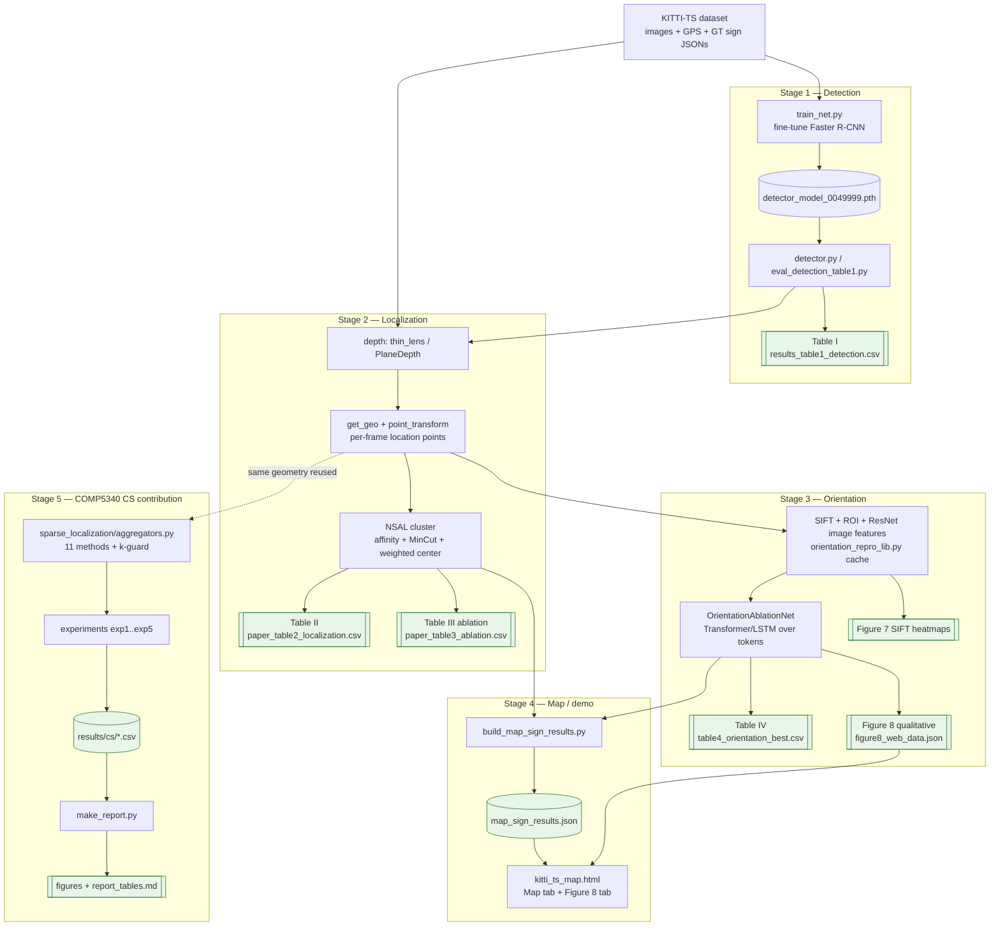
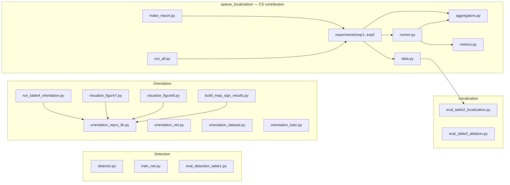
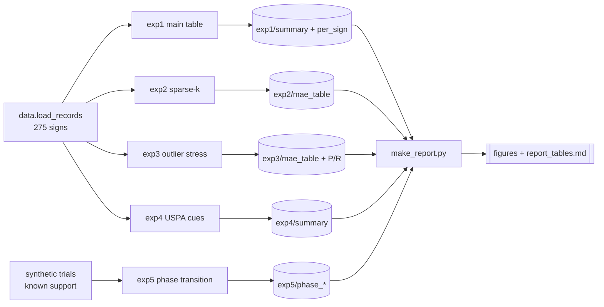
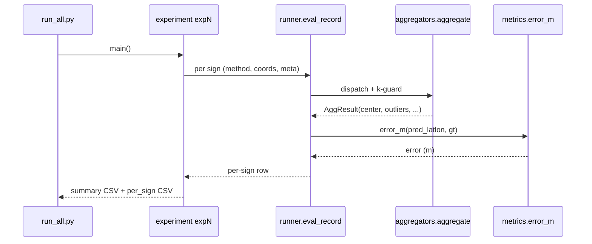

# Code → Algorithm → Result Map (full pipeline)

**What this is.** A single reference that answers three questions for the whole
repo, end to end:

1. **Which code produces which result?** (traceability tables, with the exact
   output file and headline number)
2. **Which algorithm does each piece of code run?** (named, with the paper /
   proposal section)
3. **What does the algorithm actually do?** (pseudocode, derived from the source)

Plus Mermaid diagrams of the architecture and data flow (they render directly on
GitHub and in VS Code preview).

> Scope: the full AutoTS reproduction **and** the COMP5340 sparse-recovery
> contribution. The contribution lives in `AutoTS/sparse_localization/` and is
> covered in most depth (Part F). All paths are relative to `AutoTS/`.

---

## TL;DR — the 5 stages

| # | Stage | Main code | Algorithm | Headline result |
|---|-------|-----------|-----------|-----------------|
| 1 | **Detection** | `detector.py`, `train_net.py`, `eval_detection_table1.py` | Faster R-CNN (ResNeXt-101-FPN, Detectron2) | **Table I** — AP **71.72**, AP50 85.92 |
| 2 | **Localization** | `eval_table2_localization.py`, `eval_table3_ablation.py` | depth → geo-projection → **NSAL** clustering | **Table II** — AutoTS MAE **2.38 m**; **Table III** ablation |
| 3 | **Orientation** | `orientation_repro_lib.py`, `run_table4_orientation.py`, `visualize_figure7/8.py` | SIFT+ROI+image tokens → **Transformer** classifier | **Table IV** — w/ ROIS acc **85.71**; Fig 7/8 |
| 4 | **Map / demo** | `build_map_sign_results.py`, `kitti_ts_map.html` | NSAL location + orientation per sign → JSON → web map | `map_sign_results.json`, interactive demo |
| 5 | **CS contribution** | `sparse_localization/` | 11 aggregators (sparse outlier recovery) + 5 experiments | `results/cs/` — exp1 MAE **2.33–2.42 m** |

---

## A. Big-picture pipeline



**Key reuse arrow (dotted):** the CS module's `data.py` imports
`eval_table2_localization` so the 11 aggregators run on **exactly the same**
location points and coordinate space as the reproduced Table II. That is why CS
`nsal` reproduces the Table II AutoTS MAE (≈2.36 m) — the sanity check that the
contribution is wired in correctly.

---

## B. File → module dependency map



---

## C. Stage 1 — Detection (Table I)

| Code | Algorithm | Input | Output / result file | Result |
|------|-----------|-------|----------------------|--------|
| `train_net.py::main` | Detectron2 training loop, Faster R-CNN ResNeXt-101-FPN, batch 12, 50K iters | KITTI-TS train + COCO-pretrained weights | `detector_model_0049999.pth` | trained detector |
| `detector.py::Detector` | Detectron2 `DefaultPredictor` wrapper (score thresh 0.7) | one image | boxes (demo via `main.py`) | — |
| `eval_detection_table1.py::run_detection_eval` | COCO AP evaluation | test set + checkpoint | `results/v1_original_code/results_table1_detection.csv`, `results/table1_claims_verification.md` | **AP 71.72, AP50 85.92, AP75 84.89, APs 69.44, APm 75.09** (all ≥ paper) |

---

## D. Stage 2 — Localization (Tables II & III)

`eval_table2_localization.py` is the geometric core; `eval_table3_ablation.py`
swaps only the aggregation step.

| Function | Algorithm | Produces |
|----------|-----------|----------|
| `load_all_signs()` | read KITTI-TS GT JSONs | per-sign frames, boxes, GPS, GT |
| `thin_lens_depth(box, cat)` | depth from known physical sign size & focal length (GeoLocating) | depth (m) per detection |
| `planedepth_depth(box, img_depth)` | sample the PlaneDepth depth map under the box (AutoTS) | depth (m) per detection |
| `compute_location_points()` | depth + camera yaw + horizontal FOV angle → `get_geo()` | list of `[lat, lon]` location points |
| `get_geo(lat,lng,depth,alt)` | geodesic forward projection (move `depth` m at bearing `alt`) | one `[lat, lon]` |
| `point_transform()` | WGS84 → **EPSG:3044** metric projection | `(x, y)` metres |
| `nsal_cluster` / `gaussian_affinity_matrix` | **NSAL**: Gaussian affinity → MinCut-style outlier drop → degree-weighted centre | final sign location |

**Methods compared → `results/paper_table2_localization.csv`:**

| Method | depth | aggregation | MAE | RMSE | R@1m | R@2m |
|--------|-------|-------------|-----|------|------|------|
| GeoLocating [7] | thin-lens | DBSCAN | 3.98 | 6.27 | 11.86 | 22.03 |
| GeoLocating+NSAL | thin-lens | NSAL | 3.80 | 5.92 | 15.25 | 27.12 |
| **AutoTS (ours)** | PlaneDepth | NSAL | **2.38** | **3.42** | **30.51** | **54.23** |

**Table III ablation → `results/paper_table3_ablation.csv`** (same points, swap
aggregation only): full NSAL **2.38 m** beats w/o-MinCut 2.51, w/o-Weight 2.49,
K-Means 2.56, DBSCAN 2.48 — i.e. both MinCut and the weighting matter.

---

## E. Stage 3 — Orientation (Table IV, Figures 7 & 8)

| Code | Algorithm | Output | Result |
|------|-----------|--------|--------|
| `orientation_repro_lib.py::build_or_load_cache` | run detector + ResNet + SIFT once, cache per sign | `results/orientation_cache/*` | feature cache |
| `…::select_detected_sequence` | per-frame best-IoU match of detection → GT box (assoc. fix) | per-sign frame sequence | recovered multi-frame points |
| `…::OrientationAblationNet` | `[ROI ; SIFT]` tokens → **Transformer/LSTM** encoder, concat mean ResNet image feature → 3-class head | logits {Left, Back, Right} | orientation prediction |
| `run_table4_orientation.py` | train+eval 8 ablation variants (seed 42) | `results/table4_orientation/table4_orientation_best.csv` | see below |
| `visualize_figure7.py` | SIFT descriptor heatmaps | `results/figure7/figure7_sift_heatmaps.png` | Figure 7 |
| `visualize_figure8.py` | qualitative localization + orientation on map tiles | `figure8_qualitative.png`, `figure8_web_data.json`, `figure8_location_points.csv` | Figure 8 |

**Table IV (best) → `table4_orientation_best.csv`:**

| Variant | Accuracy | mRecall |
|---------|----------|---------|
| AutoTS w/ ROIS | **85.71** | **71.70** (matches paper *ours*) |
| AutoTS w/ ROI | 84.13 | 64.09 |
| AutoTS w/o MImg | 84.13 | 70.51 |
| AutoTS (ours) | 77.78 | 61.19 |

---

## F. Stage 5 — COMP5340 CS contribution (`sparse_localization/`)

This is the new contribution. It reframes the point-aggregation step as **sparse
outlier recovery**:

```
p_i = l_s + e_i + eps_i      (e_i = sparse gross outlier, eps_i = dense noise)
recover the true location l_s from the k noisy points {p_i}
```

### F.1 Code → algorithm → result (per file)

| File · function | Algorithm | Input | Output file | Result / role |
|-----------------|-----------|-------|-------------|---------------|
| `data.py::load_records` | build per-sign points (reuses Table II geometry) + depth/area meta | KITTI-TS | in-memory `SignRecord`s | shared input for all experiments |
| `aggregators.py::mean/median/geometric_median` | classic robust centres (Weiszfeld for geo-median) | k×2 coords | — | baselines |
| `aggregators.py::kmeans/dbscan` | largest-cluster centroid | k×2 coords | — | cluster baselines |
| `aggregators.py::nsal` | Gaussian affinity + MinCut + degree-weighted centre | k×2 coords | — | **paper method** (≈ Table II) |
| `aggregators.py::l1_sor` | group-sparse L1 outlier recovery (alternating soft-threshold) | k×2 coords | `outlier_scores`, `residual` | CS convex |
| `aggregators.py::omp/cosamp/sp` | annihilator reduction `z=Fy` + block greedy pursuit | k×2 coords | `outlier_idx`, `assumed_s` | CS greedy |
| `aggregators.py::uspa` | NSAL degree × reliability `q_i` (depth/area/conf) | coords + meta | — | **proposed** |
| `aggregators.py::aggregate` | dispatch + **k-guard** (k<7 → geo-median fallback; s ≤ ⌊(k−1)/2⌋) | method, coords | `AggResult` | single entry point |
| `runner.py::eval_record` | run aggregator, project back, geodesic error, log row | one sign | per-sign CSV row | 3-level logging |
| `metrics.py::summarize` | MAE / RMSE / R@1m / R@2m | errors | summary dict | metrics |
| `experiments/exp1..5` | the 5 studies (below) | records | `results/cs/exp*/` | tables + figures |
| `make_report.py` | CSV → plots + filled markdown | `results/cs/*` | `figures/*.png`, `report_tables.md` | report artifacts |

### F.2 The 5 experiments → outputs



| Exp | Question | Sweep | Output | Headline finding |
|-----|----------|-------|--------|------------------|
| 1 | full-cloud accuracy | all methods, all points | `summary_exp1.csv` | all robust methods 2.33–2.42 m; `cosamp` best 2.33 |
| 2 | recovery from few points | k ∈ {2,3,5,10,20,all}, 5 seeds | `mae_table_exp2.csv` | k<7 → sparse rows = geo-median (k-guard by design) |
| 3 | outlier robustness | ratio ∈ {0..0.4}, mag {5,10,20} | `mae_table_exp3.csv` | `mean` degrades fastest; `median/l1_sor` slowest |
| 4 | USPA reliability cues | q variants | `summary_exp4.csv` | cues move metrics marginally (depth→R@2m, area→R@1m) |
| 5 | CS theory check | (m,s) grid, 100 trials | `phase_<method>.csv` | exact recovery collapses when `2s+1>m`; cosamp ⟩ omp |

**exp1 numbers (`summary_exp1.csv`):** mean 2.425 · median 2.354 · geo-median
2.360 · dbscan 2.377 · **nsal 2.359** · l1_sor 2.362 · omp 2.419 · **cosamp
2.330** · sp 2.357 · uspa 2.384  (fallback rate 0.207 for the 4 sparse methods).

**exp5 (omp, exact-recovery rate by m):** s=1 → 0.73/0.99/1.0/0.99 across
m=4/8/12/16; s=3 → 0.28/0.63/0.92/0.91. Sharpens with m, collapses at small m —
exactly the CS phase transition.

---

## G. Pseudocode (derived from the source)

### G.1 Localization geometry (Stage 2, per sign)
```
for each frame f with detection box b:
    depth  = thin_lens(b, category)   OR   planedepth(b, depth_map[f])
    angle  = (box_center_x - CENTER_X) * (FOV_X / CENTER_X)
    bearing= camera_yaw[f] - angle
    point  = get_geo(gps[f], depth, bearing)        # geodesic forward step
location = NSAL_cluster( [point_transform(p) for p in points] )   # -> lat,lon
```

### G.2 NSAL cluster (paper method)
```
W            = exp(-pairwise_sqdist / (2 sigma^2))      # Gaussian affinity
deg_i        = sum_j W[i,j]                              # graph degree
# MinCut surrogate: drop the lowest-degree points whose degree gap is anomalous
diffs        = diff(sort(deg))
num_del      = min(0.3*k, #leading diffs > 3*mean(diffs))
outliers     = indices of the num_del smallest deg
keep         = points not in outliers
center       = weighted_mean(keep, weights = normalized deg[keep])   # degree-weighted
```

### G.3 L1-SOR — group-sparse outlier recovery (CS convex)
```
min over l, {e_i}:  1/2 * sum_i ||p_i - l - e_i||^2 + lambda * sum_i ||e_i||_2
solve by alternating minimization:
    repeat:
        r_i   = p_i - l                              # residual
        e_i   = max(0, 1 - lambda/||r_i||) * r_i     # group soft-threshold (prox)
        l     = mean_i (p_i - e_i)                   # location update
    until l converges
outliers = { i : ||e_i|| > 0 }
```

### G.4 Greedy CS — annihilator reduction + block pursuit (OMP / CoSaMP / SP)
```
# Stack the k observations: y = vec(coords) in R^{2k}.  Location lives in range(A),
# A = [I2; I2; ...].  F = orthonormal basis of null(A^T)  ->  F A = 0.
z   = Phi @ y           # Phi = F (annihilator) or R*P_perp (random Gaussian); kills l
                        # so z depends only on the outliers e and noise eps.
support = {}
OMP:    repeat s times: add the block (x_i,y_i) most correlated with residual; re-fit by LS
CoSaMP/SP: repeat: merge top blocks with current support, LS-fit, prune to strongest s
e_hat   = LS solution on the recovered support
location= mean of the inlier observations (i not in support)
```

### G.5 USPA — uncertainty-aware aggregation (proposed)
```
deg_i = sum_j gaussian_affinity[i,j]                 # spatial support (like NSAL)
q_i   = area_i_norm * exp(-lambda_d * depth_i)       # reliability cue (variant-dependent)
w_i   = deg_i * q_i
location = sum_i (w_i / sum w) * p_i                  # reliability-weighted center
```

### G.6 k-guard dispatch (the safety rule)
```
aggregate(method, coords, meta):
    k = len(coords)
    if method in {l1_sor, omp, cosamp, sp} and k < K_MIN(=7):
        return geometric_median(coords)  with fallback_triggered = True
    if method in {omp, cosamp, sp}:
        s = clamp(s_user, 1, floor((k-1)/2))         # error-correction limit
    return the chosen aggregator
```

### G.7 Orientation classifier (Stage 3)
```
per sign: sequence of frames, each frame -> token [ROI_feat ; SIFT_feat]
seq  = TransformerEncoder( Linear(ROI) ++ Linear(SIFT) )   # or LSTM / BiLSTM
seq_feature = mean_pool(seq)
img_feature = mean_t( Linear(ResNet_image_feat_t) )
logits = Linear( [seq_feature ; img_feature] )             # 3 classes: Left/Back/Right
```

---

## H. Which algorithm wins where (honest interpretation)

- **Clean full clouds (exp1):** every robust method lands ≈2.33–2.39 m; `cosamp`
  edges ahead, `nsal` ties the paper. Sparse recovery is *not* expected to beat
  NSAL here — the recovered clouds are already clean (nothing for outlier
  recovery to remove). State this plainly.
- **Few observations (exp2):** at k∈{2,3,5} the sparse rows equal
  `geometric_median` exactly — the **k-guard fallback firing by design**, not a
  bug. Compare across methods within a k-row, not down a column (each k filters a
  different sign subset).
- **Outlier stress (exp3):** `mean` collapses fastest; `median`, `geometric_median`,
  `l1_sor` are most robust; `omp` is the weakest sparse method (no backtracking).
- **USPA cues (exp4):** marginal gains — cues aren't perfectly calibrated to
  localization error. An honest negative-ish result.
- **Phase transition (exp5):** exact support recovery sharpens with `m` and
  collapses once `2s+1 > m`; `cosamp` strongest, `omp` weakest — matches CS
  theory (RIP / error-correction bound).

---

## I. How to regenerate every result

```bash
cd AutoTS
# Stage 2/3 tables (need dataset + checkpoints)
python eval_table2_localization.py
python eval_table3_ablation.py
python run_table4_orientation.py --epochs 300 --seed 42
python visualize_figure7.py && python visualize_figure8.py
python build_map_sign_results.py

# Stage 5 — CS contribution (runs out-of-the-box; thin-lens fallback if no depth npz)
python -m sparse_localization.run_all          # all 5 experiments -> results/cs/
python -m sparse_localization.make_report       # figures + report_tables.md

# View the demo (must be over HTTP, not file://)
python3 -m http.server 8765 --directory .
# open http://127.0.0.1:8765/kitti_ts_map.html#figure8
```

