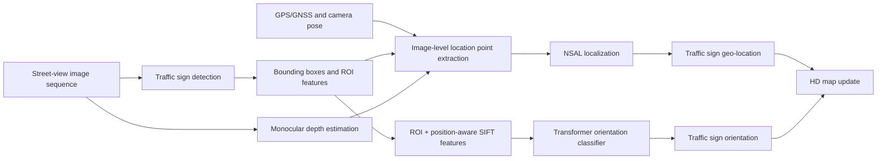
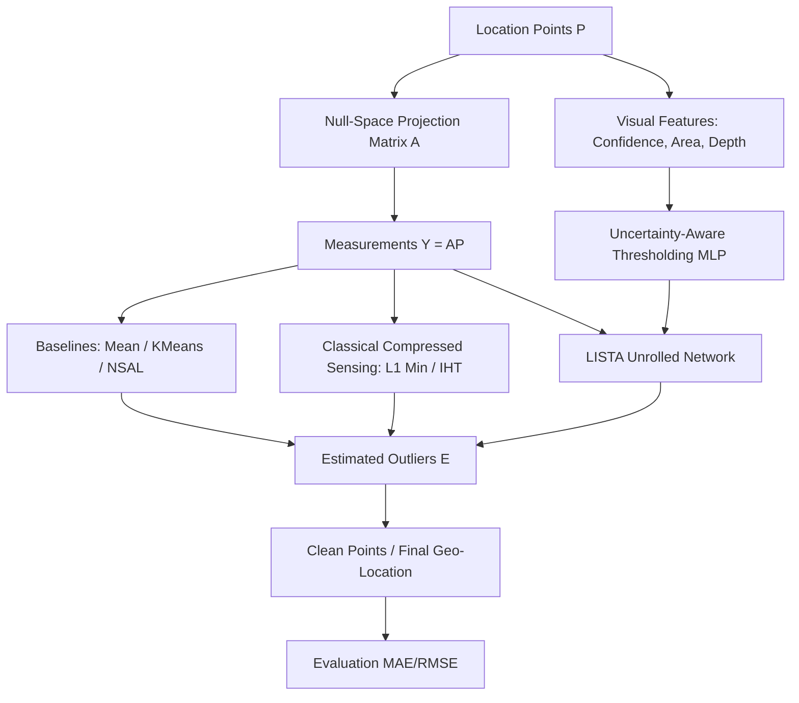

# Sparse-Aware Traffic Sign Localization from Vision-GPS Data

## 1. Paper under analysis

Han et al. 2025, "Traffic Sign Localization and Orientation Classification for Automated Map Updating."

The paper proposes AutoTS, a system that localizes traffic signs on HD maps using street-view image sequences paired with GPS/GNSS coordinates. The system outputs sign category (speed limit, yield, no entry), geographic position (latitude, longitude), and orientation relative to the ego vehicle (leftward, backward, rightward).

AutoTS has three modules:

1. Traffic sign detection via fine-tuned Faster R-CNN.
2. Noise and Sparsity Adaptive Localization (NSAL), which infers a final geographic position from noisy, sparse location points.
3. Position-aware orientation classification using ROI features, position-aware SIFT, road context, and a Transformer encoder to determine whether a detected sign belongs to the road the vehicle is driving on.

The NSAL module is most relevant to COMP5340 because it directly addresses noisy and sparse location points.

---

## 2. Connecting GPS, sparsity, and computer vision

The paper sits at the intersection of three elements:

| Component | Role in the paper | Relevance to project |
| --- | --- | --- |
| Computer Vision | Sign detection, bounding boxes, ROI features, SIFT, monocular depth | Input is street-view image sequences |
| GPS/GNSS | Each image carries the vehicle's GPS position | GPS projects sign detections from image space to geographic coordinates |
| Sparse data | Some signs appear in very few frames due to narrow FOV, occlusion, poor lighting, or missed detections | The location point set can be extremely sparse |
| Sparse/outlier recovery | Some estimated locations are wrong due to GPS noise, depth error, or detection error | Localization becomes recovery of a true position from sparse corrupted observations |

The project should not be framed as traffic sign detection. A better framing:

> Sparse-aware localization from noisy vision-GPS observations for automated HD map updating.

This framing aligns with Compressive Sensing and Sparse Recovery.

---

## 3. Why full reproduction is impractical

AutoTS is a multi-stage pipeline, not a single model. Reproducing the entire system requires dataset construction, object detection, depth estimation, GPS geometry, graph-based localization, and sequence-based orientation classification.

### 3.1 Components required for full reproduction

1. KITTI-TS dataset: sign annotations, bounding boxes, orientation labels, ground-truth geo-locations, synchronized image/GPS/camera/depth data.
2. Faster R-CNN with ResNeXt-101-FPN backbone, fine-tuned on KITTI-TS.
3. PlaneDepth or equivalent monocular depth estimator.
4. GPS-to-location projection using camera yaw, horizontal FOV, bounding box deviation, depth, and GPS.
5. NSAL: affinity matrix construction, minimum-cut noisy point removal, weighted geo-location estimation.
6. Orientation classifier: ROI features, position-aware SIFT, Transformer/LSTM/BiLSTM training with weighted cross-entropy for class imbalance.
7. Evaluation: MAE, RMSE, Recall@1m, Recall@2m for localization; Accuracy, mRecall for orientation.

### 3.2 Reproduction risks

| Risk | Reason |
| --- | --- |
| Dataset availability | Processed KITTI-TS annotations may not be directly usable |
| Preprocessing complexity | Matching signs across image sequences, GPS, camera calibration, and depth is time-consuming |
| Compute cost | Fine-tuning Faster R-CNN and running depth estimation on many images requires GPU |
| Engineering burden | Multiple modules; one broken module blocks the entire pipeline |
| Course timeline | 15-minute presentation; full reproduction is too broad |

### 3.3 Recommendation

Do not reproduce all of AutoTS. Reproduce the localization module (NSAL) because it is the part most connected to sparsity, can be evaluated independently, has a clear research gap, and leaves room for a small but meaningful novelty.

---

## 4. What to reproduce

### 4.1 Required scope

Reproduce NSAL localization using precomputed or generated location points.

The task starts after each detected traffic sign has been converted into a set of estimated location points:

$$
P_s = \{p_1, p_2, \ldots, p_n\}.
$$

From these points, estimate the final sign position:

$$
\tilde{l}_s = f(P_s).
$$

### 4.2 Baselines to implement

| Method | Purpose |
| --- | --- |
| Mean center | Simplest baseline |
| Median or geometric median | Robust baseline |
| K-Means | Clustering baseline |
| DBSCAN | Noise-aware clustering baseline |
| NSAL | Reproduced method from AutoTS |
| Ours | Proposed sparse/uncertainty-aware improvement |

### 4.3 Optional extension

If time permits, run a sparse observation experiment: retain only 2, 3, 5, 10, or 20 location points per sign and evaluate how localization degrades with increasing sparsity. Compare NSAL and the proposed method at each sparsity level.

### 4.4 Out of scope

To keep the project feasible, defer the following: full Faster R-CNN training, PlaneDepth reproduction, full orientation classification pipeline, complete HD map update system, large-scale deployment or real-time inference.

---

## 5. Research gap

AutoTS handles noisy and sparse location points, but its weighting strategy relies on graph density alone. It does not use observation reliability: detection confidence, depth uncertainty, distance to camera, bounding box size, or temporal consistency.

NSAL assigns weight based on graph degree:

$$
D[i,i] = \sum_j W_{ij},
$$

where affinity between two points uses a Gaussian kernel:

$$
W_{ij} = \exp\left(-\frac{\|p_i - p_j\|^2}{2\sigma^2}\right).
$$

A point gets a high weight if it is close to many other points. This is reasonable but insufficient.

### 5.1 Limitations of graph-degree-only weighting

A location point can be close to many others and still be unreliable if:

- the traffic sign was detected with low confidence,
- the bounding box is very small (sign is far away),
- estimated depth is large and likely less accurate,
- the GPS signal in that frame was unstable,
- the point is temporally inconsistent with neighboring frames.

Graph density alone cannot distinguish reliable from unreliable observations in sparse settings.

### 5.2 Sparse recovery interpretation

Each estimated location point $p_i \in \mathbb{R}^2$ can be modeled as:

$$
p_i = l_s + e_i + \epsilon_i,
$$

where $l_s$ is the true sign position, $e_i$ is a sparse gross error or outlier (e.g., failed depth or missed bounding box), and $\epsilon_i$ is small dense Gaussian noise.

To map this to the standard compressed sensing framework ($y = Ax$), we represent the $n$ observations as a matrix $P \in \mathbb{R}^{n \times 2}$:

$$
P = \mathbf{1} l_s^T + E + N
$$

We apply a left-annihilator (projection) matrix $\Phi \in \mathbb{R}^{(n-1) \times n}$ such that $\Phi \mathbf{1} = \mathbf{0}$ (for example, a difference matrix where $\Phi_{i,i}=1$ and $\Phi_{i,i+1}=-1$). Multiplying both sides by $\Phi$ eliminates the unknown true location $l_s$:

$$
\Phi P = \Phi E + \Phi N
$$

Let $Y = \Phi P$ be our known measurements and $A = \Phi$ be our known sensing matrix. We arrive at the canonical compressed sensing equation:

$$
Y = A E + \tilde{N}
$$

The problem reduces to recovering the sparse outlier matrix $E$ from underdetermined measurements $Y$. Once $E$ is recovered, the clean points are identified, and $l_s$ can be trivially computed as the mean of the clean observations.

---

## 6. Proposed method: Uncertainty-Aware Learned ISTA (LISTA)

### 6.1 Core idea

Classical compressed sensing solves the $Y = AE$ problem using Iterative Shrinkage-Thresholding Algorithms (ISTA) or $\ell_1$ minimization (Basis Pursuit). A standard ISTA iteration updates the sparse estimate $E^{(k)}$ via:

$$
E^{(k+1)} = \eta_{\theta}\left( E^{(k)} + \frac{1}{L} A^T (Y - A E^{(k)}) \right)
$$

where $\eta_{\theta}(\cdot)$ is the soft-thresholding operator with threshold $\theta$.

To satisfy the course's deep learning requirement, we propose **Deep Unfolded ISTA (LISTA)**. We unroll the optimization iterations into a $K$-layer neural network:

$$
E^{(k+1)} = \eta_{\theta_k}\left( W_1^{(k)} Y + W_2^{(k)} E^{(k)} \right)
$$

### 6.2 Uncertainty-Aware Thresholding Gate

Standard LISTA uses a global, learned threshold $\theta_k$. However, in vision-GPS localization, we have rich side-information indicating observation reliability (detection confidence $c_i$, bounding box area $a_i$, and estimated depth $d_i$).

We introduce an **Uncertainty-Aware Thresholding Gate**: we train a small MLP to dynamically predict the sparsity threshold for each point based on its visual reliability features.

$$
\theta_{k, i} = \text{MLP}^{(k)}(c_i, a_i, d_i)
$$

This acts as a learned sparse gating mechanism. Unreliable observations (low confidence, large depth) are assigned a lower threshold (forcing them into the outlier set $E$), while highly reliable observations are preserved. 

### 6.3 Why this method is sparse-aware

This method bridges operational CV tasks with rigorous sparse recovery mathematics. It constructs an exact compressed sensing matrix problem, uses sparsity-inducing optimization (ISTA), and integrates deep learning via algorithm unrolling and dynamic threshold gating.

---

## 7. Novelty

### 7.1 Controlled sparsity evaluation

The original paper evaluates sparse samples, but this project applies systematic control over observation count:

$$
k \in \{2, 3, 5, 10, 20, \text{all}\}.
$$

This answers a practical question: how many visual-GPS observations are needed to localize a traffic sign reliably?

### 7.2 Uncertainty-aware sparse weighting

Adding reliability-aware weighting on top of graph degree addresses NSAL's blind spot: a point must not only be in a dense region, it must also come from a reliable observation.

### 7.3 Sparse outlier interpretation

Formulating localization error as sparse corruption ($p_i = l_s + e_i + \epsilon_i$) connects the method to sparse recovery and aligns the project with COMP5340.

### 7.4 Expected contribution statement

> We reproduce the NSAL localization module of AutoTS and propose an uncertainty-aware sparse aggregation strategy that improves robustness under sparse and noisy visual-GPS observations. We introduce a controlled sparsity evaluation protocol to study localization performance when only a few traffic sign observations are available.

---

## 8. Research proposal

### 8.1 Title

Deep Unfolded Sparse Recovery for Uncertainty-Aware Traffic Sign Localization

### 8.2 Motivation

HD map updating extracts location points from multi-view dashboard camera sequences. Due to varying depth accuracy, occlusions, and GPS noise, the location points contain dense small noise and sparse gross outliers. By applying a null-space projection to eliminate the ground-truth location variable, we reduce the problem to recovering a sparse outlier vector from underdetermined measurements, enabling the direct application of sparse representation theory and compressed sensing.

### 8.3 Research question

Can deep unrolled optimization (LISTA) with uncertainty-aware thresholding gates improve outlier rejection and localization accuracy compared to classical graph-density methods (NSAL) and generic $\ell_1$ minimization?

### 8.4 Hypothesis

By dynamically parameterizing the soft-thresholding gate using visual confidence cues, Uncertainty-Aware LISTA will recover sparse outliers more accurately than classical Basis Pursuit or graph-based NSAL, especially under extremely sparse observation settings ($k \le 5$).

### 8.5 Method overview

1. Formulate the projection matrix $A$ and extract location points $P$ to yield measurements $Y = AP$.
2. Implement baseline $\ell_1$ minimization (Basis Pursuit) and classical Iterative Hard Thresholding (IHT).
3. Reproduce NSAL.
4. Implement the $K$-layer Uncertainty-Aware LISTA network.
5. Create controlled sparse observation settings ($k \in \{2, 3, 5, 10\}$).
6. Evaluate using MAE, RMSE, Recall@1m, Recall@2m.

---

## 9. Workflow and pipeline

### 9.1 Full paper pipeline



### 9.2 Project pipeline



### 9.3 Mathematical pipeline

```mermaid
flowchart LR
    A[P = 1 L + E + N] -->|Projection A| B[Y = AE + N]
    B --> C[LISTA Layer k]
    C -->|Soft Thresholding| D[E_k+1 = η_θ(W1 Y + W2 E_k)]
    E[Visual Features] -->|MLP| F[Dynamic Gate θ]
    F --> D
    D --> G[Sparse Outliers E]
    G --> H[Final Location l_s]
```

---

## 10. Implementation steps

### Step 1: Read and understand the paper

Summarize AutoTS. Identify which module relates to sparsity. Extract NSAL formulas. Understand localization metrics.

### Step 2: Check code and dataset availability

Check whether the AutoTS repository provides processed KITTI-TS data. Check whether location points are available directly. If not, choose among:
- Aalborg location points,
- simulated sparse/noisy location points,
- generated location points from existing KITTI data.

### Step 3: Implement baseline localization methods

Implement Mean center, Median or geometric median, K-Means center, DBSCAN center, and NSAL.

### Step 4: Reproduce NSAL

Reproduce the affinity matrix:

$$
W_{ij} = \exp\left(-\frac{\|p_i-p_j\|^2}{2\sigma^2}\right),
$$

then implement minimum-cut noisy point removal and weighted geo-location extraction.

### Step 5: Build sparse observation benchmark

For each traffic sign, sample:

$$
k \in \{2, 3, 5, 10, 20\}
$$

location points from the original set. Repeat random sampling multiple times for stability.

### Step 6: Implement proposed method

Implement uncertainty-aware weighting:

$$
w_i = \left(\sum_j W_{ij}\right) \cdot q_i.
$$

Test multiple versions of $q_i$: depth-only, bbox-area-only, confidence-only, combined.

### Step 7: Evaluation

Evaluate using MAE, RMSE, Recall@1m, Recall@2m, performance under sparse settings, and sensitivity to hyperparameters $\sigma$, $\alpha$, and $\lambda$.

### Step 8: Analysis and report

Analyze: Does the proposed method improve over NSAL under sparse observations? Does it help more when $k$ is small? Which reliability cue is most useful? Where does the method fail? How do results connect to sparse recovery?

---

## 11. Team division for 4 members

### Member 1: Paper understanding and project framing

Read AutoTS in detail. Summarize related work. Write motivation and problem formulation. Connect the project to sparse recovery and COMP5340. Prepare the proposal introduction and report structure.

Deliverables: paper summary, problem formulation, related work notes, proposal draft.

### Member 2: Dataset, code, and preprocessing

Check AutoTS repository and dataset availability. Prepare location point data. Write data loading scripts. Handle coordinate formats and train/test splits. Prepare the sparse sampling protocol.

Deliverables: data loading pipeline, cleaned location point dataset, sparse observation benchmark, reproducibility notes.

### Member 3: Baseline and NSAL reproduction

Implement Mean, Median, K-Means, and DBSCAN baselines. Reproduce NSAL. Implement evaluation metrics. Verify reproduced results against the paper where possible.

Deliverables: baseline code, reproduced NSAL code, initial result tables, ablation on MinCut and weighting.

### Member 4: Proposed method, experiments, and visualization

Implement uncertainty-aware sparse weighting. Run experiments across sparsity levels. Compare proposed method against NSAL and baselines. Create plots and workflow diagrams. Help write the final analysis and presentation slides.

Deliverables: proposed method code, experiment results, figures and visualizations, final presentation materials.

### Why 4 members

The project has four independent work streams: theory and paper understanding, data engineering, reproduction and baseline implementation, novel method with experiments and reporting. A single person covering all four would risk missing the deadline.

---

## 12. Timeline

For a 5-6 week project:

| Week | Main task | Expected output |
| --- | --- | --- |
| 1 | Read paper, check repo/dataset, finalize scope | Proposal, task division, dataset decision |
| 2 | Data loading and baseline methods | Mean/Median/KMeans/DBSCAN results |
| 3 | Reproduce NSAL and verify metrics | NSAL reproduction table |
| 4 | Sparse observation benchmark and proposed weighting | Initial novelty results |
| 5 | Full experiments, ablations, hyperparameter sweeps | Final tables and plots |
| 6 | Report writing, slides, analysis polish | Final report and presentation |

Minimum viable scope for a 3-4 week timeline: location point data, Mean, DBSCAN, NSAL, proposed uncertainty-aware NSAL, and the sparse observation experiment.

---

## 13. Resource requirements

### 13.1 Compute

| Task | Requirement |
| --- | --- |
| Location point aggregation | CPU |
| K-Means / DBSCAN / NSAL | CPU |
| Sparse sampling experiments | CPU |
| Fine-tune traffic sign detector | GPU (optional) |
| Monocular depth estimation | GPU (optional) |
| Orientation classifier | GPU (optional) |

### 13.2 Software

Minimum: Python, NumPy, SciPy, scikit-learn, pandas, matplotlib. Optional: PyTorch, OpenCV/SIFT.

For broader pipeline reproduction: GPU (RTX 3090/4090 or server), Detectron2, PyTorch, PlaneDepth checkpoint, KITTI raw data and calibration files.

### 13.3 Data

Best case: processed KITTI-TS location point files from the authors.

Fallback options:
1. Aalborg location point dataset if available.
2. Released AutoTS intermediate outputs.
3. Simulated noisy sparse point sets around known sign locations.
4. Small proof-of-concept on a subset.

---

## 14. Expected results

We expect the proposed uncertainty-aware sparse aggregation to perform comparably to NSAL when observations are dense, outperform NSAL when observations are sparse, reduce MAE/RMSE under noisy conditions, improve Recall@1m or Recall@2m in sparse settings, and provide clearer analysis of how sparsity affects localization reliability.

A realistic and defensible claim:

> The proposed method improves robustness under sparse observations rather than universally outperforming NSAL in every setting.

---

## 15. Alignment with COMP5340 project guide

The project guide emphasizes sparsity, low-rank structure, and efficient representations in deep learning. The guide also encourages students to choose topics that are interesting, relevant to their research group, and matched to their background. This project fits when framed as sparse recovery from noisy visual-GPS observations.

### 15.1 Theme alignment

| Guide theme | How the project aligns |
| --- | --- |
| Sparsity | Sparse outlier representation of geometric measurement errors |
| Sparse recovery | Exact $Y = AE$ compressed sensing formulation via null-space projection |
| Efficient representation | Unrolling classical optimization (IHT/ISTA) into a compact LISTA network |
| Deep learning connection | Dynamic threshold gating via MLP mapping visual features to soft-thresholds |
| Practical relevance | Automated HD map updating for autonomous driving |

### 15.2 Grading criteria alignment

| Criterion | How the project meets it |
| --- | --- |
| Effort | Paper analysis, data preparation, reproduction, experiments, report writing |
| Subject understanding | Explicit sparse observation and sparse outlier recovery formulation |
| Originality | Uncertainty-aware sparse weighting extends beyond reproduction |
| Technical quality | Evaluation with MAE, RMSE, Recall@1m, Recall@2m, ablations, sparse stress tests |
| Elegant solution | Single reliability term added to NSAL, simple and interpretable |
| Efficient implementation | Main project runs on CPU with location points; avoids unnecessary detector training |
| Presentation quality | Clear workflow, visual figures, sparse recovery motivation |

---

## 16. Recommendation

Reproduce the localization module of AutoTS and extend it with uncertainty-aware sparse point aggregation.

Avoid full reproduction of the entire AutoTS pipeline; the scope is too broad for a course project. The strongest and most feasible scope:

1. Focus on sparse/noisy location point aggregation.
2. Reproduce NSAL and simple baselines.
3. Create controlled sparse observation settings.
4. Propose reliability-aware sparse weighting.
5. Evaluate whether the method improves localization robustness.

This scope connects GPS, sparse recovery, and computer vision. It offers sufficient novelty, manageable scope, and fits a 4-person team in COMP5340.

[KITTI-TS_dataset_report](autots_sparse_project_report_vi/KITTI-TS_dataset_report%20adbe01e4704d82078b3f01199160d1a3.md)
